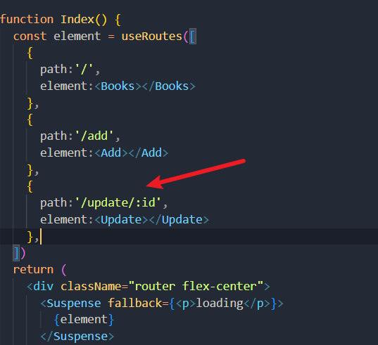
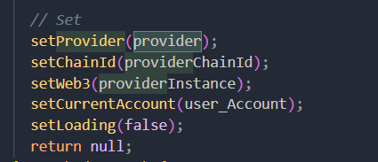

# 区块链惯用


## 连接钱包

使用window.ethereum自带的连接方法 以及useWeb3React hooks 进行连接

### 配置网络连接

./netConfig.js

```js
export const NETWORK = {
  name:'Fibo Chain',
  chainId: '0x3012',  // 1230  //12306 //十六进制 3012
  chainName: 'FIBO',
  rpcUrls: ['https://node.fibochain.org'],
  faucets: ["https://www.fibochain.org/drawdex"],
  explorers: [],
  infoURL: "https://www.fibochain.org/",
  network: "fibochain",
  networkId: 12306,  //12306
  nativeCurrency: {
    name: 'fibo',
    symbol: 'FIBO',
    decimals: 18,
    }

};
```


### window.ethereum小狐狸钱包api

[Ethereum Provider API | MetaMask Docs](https://docs.metamask.io/guide/ethereum-provider.html#methods)


### useWeb3React的Hooks

导入相应的包

```cmd
yarn add ethers
yarn add web3 # optional

yarn add @web3-react/core
yarn add @ethersproject/providers
```

配置连接器  ./connector.js

```js
import { InjectedConnector } from '@web3-react/injected-connector'
import {NETWORK} from './netConfig'
export const injected = new InjectedConnector({
  supportedChainIds: [1,43113,3021,NETWORK.chainId,12306,1230]  //里面添加要链接的chainId和chainId的十六进制
})

```

在入口文件添加hook的provider

```js
import React, { useEffect } from 'react';
import './index.css';
import reportWebVitals from './reportWebVitals';
import { Web3ReactProvider } from '@web3-react/core'
import { Web3Provider } from "@ethersproject/providers";
import ConnectWallet from './ConnectWallet';

const root = ReactDOM.createRoot(document.getElementById('root'));
root.render(
    <Web3ReactProvider getLibrary={(provider) => new Web3Provider(provider)}>
      <ConnectWallet />
    </Web3ReactProvider>
    
);
reportWebVitals();

```


组件引入hooks

```js
import { useWeb3React } from "@web3-react/core"


const { active, account, library, connector, activate, deactivate } = useWeb3React();
```


### 连接组件

```js
import { injected } from './wallet/Connectors'		//引入web3hooks的连接器配置
import { NETWORK } from "./blockChain/netConfig";  //引入网络配置
import { useWeb3React } from "@web3-react/core"


  const { active, account, library, connector, activate, deactivate } = useWeb3React();
  const [isConnect,setIsConnect] = useState(false);  //是否连接 控制按钮内样式
  const [isLoading,setIsLoading] = useState(false); //正在连接中  显示缓冲图标
  const [w3,setW3] = useState();

//连接钱包
   async function ConnectWallet(){
    if(window.ethereum!==undefined){
      setIsLoading(true);
      let chainId = NETWORK.chainId;
      let chainName = NETWORK.chainName;
      let rpcUrls = NETWORK.rpcUrls;
      console.log(window.ethereum.chainId);
      if(window.ethereum.chainId=='12306'){
        //连接别的钱包
      }
      else {
        try {
          await window.ethereum.request({
              method: 'wallet_switchEthereumChain',
              params: [{chainId}],
          });
      } catch (switchError) {
          // This error code indicates that the chain has not been added to MetaMask.
          if (switchError.code === 4902) {
              try {
                  await window.ethereum.request({
                      method: 'wallet_addEthereumChain',
                      params: [
                          {
                              chainId,
                              chainName,
                              rpcUrls /* ... */,
                          },
                      ],
                  });
              } catch (addError) {
                  // handle "add" error
                  cogoToast.error("连接出错",addError);
                  setIsLoading(false);
                  // cogoToast.error("Connection error",addError);
              }
          }
        }
      }

      const web3 = new Web3(window.ethereum);
      setW3(web3);
      //连接钱包
      try{
        await window.ethereum.enable().then((res)=>{
          localStorage.setItem("currentAccount",res[0]);
        })
        activate(injected)
        setIsConnect(true);
      }catch(e){

      }
      finally{
        setIsLoading(false);
      }

      // let account = localStorage.getItem("currentAccount");
      // console.log(account);
    }
    else {
      cogoToast("请下载钱包")
      
    }
  }
```

#### 连接钱包要做的初始化工作

```js
  const web3 = new Web3(window.ethereum);
      setWeb3(web3);
      window.ethereum.enable().then(res=>{
      localStorage.setItem("currentAccount",res[0]);
      activate(injected)  //方便别的组件随时随地提取account
      setIsConnect(true);  //设置按钮的内容  未连接显示 ”连接钱包“
      // setIsLoading(false);
```


```
window.ethereum.enable()是一个用于启用Web3的API。它通常在DApp中使用以与以太坊区块链交互。此方法将弹出一个对话框，要求用户授权您的DApp访问他们的以太坊帐户。

调用此方法将返回一个Promise，该Promise将解析为一个包含所选帐户数组的对象。在使用Web3.js或其他类似库进行交互时，可能需要此数组。

需要注意的是，此方法是过时的，最新版本的MetaMask和其他以太坊钱包已不再支持它。现在建议使用 ethereum.request({ method: 'eth_requestAccounts' }) 代替。
```


## 刷新页面不用重新连接钱包

```js
  useEffect(()=>{
    let account = localStorage.getItem("currentAccount");
    if(account!=null)
    ConnectWallet()
  },[])
```


## 退出钱包

```js
  async function Disconnect() {
    try {
      localStorage.removeItem("currentAccount");
      let currentAccount =  localStorage.getItem("currentAccount");
      window.location.reload();
    } catch (ex) {
       cogoToast.error("退出钱包错误",ex);
    }
  }
```


## 切换账户

```js
 try{
    window.ethereum.on("accountsChanged",(res)=>{
      //判断
      let acc = localStorage.getItem("currentAccount");
      if(acc==null){
      }
      else {
        localStorage.setItem("currentAccount",res);
        window.location.reload();
      }
    })
  }catch(e){
	cogoToast.warn("账号连接错误")
  }
```


## 初始化Contract

```cmd
npm install web3
```

### 获得合约方法

```js
import ContractAddress from "../wallet/ContractAddress";  //钱包地址
import abi from "../wallet/abi";  //合约的abi
export default function GetContract(){
  const Web3 = require('web3');
  const web3 = new Web3(window.ethereum);
  //AWW的合约
  const awwContract = new web3.eth.Contract(abi,ContractAddress.AWW);
  return awwContract  
}
```

### 在组件中初始化

```react
import GetContract from './GetContract'

const [contract,setContract] = useState(GetContract());
```


### 应用在按钮

```js
function App(){
    const handleClick =  useThrottle(() => {
      // 设置一个状态量控制按钮加载
      setCount(count + 1);
    },2000,setLoading);
      return (
        <div className="flex flex-col items-center justify-center">
          <button onClick = {handleClick}>
            {
              loading
              ?<Spin></Spin>
              :count
            }
          </button>
        </div>
      )
 }
}


```


## 获取链上主币的方法

```js
const web3 = new Web3();
web3.eth.getBalance();
```


## 调用合约的try catch finally结构

try包裹合约的调用，合约调用中then获取成功后的res

如果合约调用出错，catch捕捉到错误

finally用于恢复状态量 例如按钮的图标的样式、输入框内容的清空

```js
 setBtnLoading(true); //按钮加载
setBtnDisabled(true);//按钮禁用
try{
      let a = BigNumber(amount).multipliedBy(Math.pow(10,18)).toString(10);
      await contract.methods.transferBySplit(addressConvert(transAddress),a).send({from:account}).then((res)=>{
        let webSite = "https://scan.fibochain.org/tx/"+res.transactionHash;
        setAmount('');
        setTransAddress('');
        cogoToast.success(
          <div>
            <span>{intl.formatMessage({id:'toast_point4'})}</span>
            <a href={webSite}>{intl.formatMessage({id:'toast_webSite'})}</a>
          </div>
        )
      })
    }catch(e){
      console.log(e);
      // cogoToast.error("Transfer Error",e)
      cogoToast.error(intl.formatMessage({id:'toast_point5'}),e)
    }finally{
      setBtnLoading(false);
      setBtnDisabled(false);
      setAmount("");
    setTransAddress("")
    }
```


总结一下 连接钱包主要使用window.ethereum 调用合约主要使用web3


## 控制转账的gas费（未实验）


​    
```react
import Web3 from 'web3';

// 创建一个 Web3 实例
const web3 = new Web3('https://mainnet.infura.io'); // 使用 Infura 提供的以太坊节点

// 转账函数
const transferFunds = async (fromAddress, toAddress, amount, gasPrice) => {
  try {
    // 获取当前以太坊网络 gasPrice
    const currentGasPrice = await web3.eth.getGasPrice();
// 设置自定义 gasPrice 或使用当前 gasPrice
const selectedGasPrice = gasPrice || currentGasPrice;

// 构造交易对象
const transactionObject = {
  from: fromAddress,
  to: toAddress,
  value: web3.utils.toWei(amount, 'ether'),
  gasPrice: selectedGasPrice,
};

// 发送交易
const transaction = await web3.eth.sendTransaction(transactionObject);

console.log('Transaction hash:', transaction.transactionHash);

  } catch (error) {
    console.error('Error:', error);
  }
};

// 使用示例
const fromAddress = '0x123...'; // 发送者地址
const toAddress = '0x456...'; // 接收者地址
const amount = '1'; // 转账金额（以太为单位）
const gasPrice = '50000000000'; // 自定义 gasPrice（可选）

transferFunds(fromAddress, toAddress, amount, gasPrice);
```


## nextjs封装框架

### wagimi

以太坊api的hooks 可以类比web3.eth功能

https://wagmi.sh/zh-CN

### rainbowkit

连接钱包的api

https://www.rainbowkit.com/docs/modal-sizes


### Configuring Chains

configureChains函数允许你用RPC供应商配置你的链，比如： Alchemy、Infura或其他东西。这意味着你不需要担心在你的连接器或公共客户端中定义RPC URLs和链条配置。这是由wagmi内部管理

```js
import { configureChains } from 'wagmi';
```


## 封装合约的一段很牛逼的代码

### 调用

```js
const { userInfo } = useSingleCallResult(AWWContract, 'userInfo', [account]);
```

```ts
// single call result
export function useSingleCallResult(
  contract: Contract | null | undefined,
  methodName: string,
  inputs?: MethodArg[],
): any {
  const { account } = Web3Provider.useContainer();
  const [data, setData] = useState<MethodArg | undefined>(undefined);
  const fragment = useMemo(
    () => contract?.interface?.getFunction(methodName.trim()),
    [contract, methodName],
  );

  useEffect(() => {
    (async () => {
      if (!fragment) return;
      const res = await contract?.[methodName.trim()](...(inputs ?? []));
      setData(res);
    })();
  }, [contract?.address, account]); // , fragment

  return useMemo(() => {
    return toCallState(data, methodName);
  }, [data]);
}
```


## 大数转换


# 知识点

## 前后端调用的逻辑

再api的接口处封装好增删改查，这里要使用trycatch包裹，并且异步任务async声明，这就代表返回的值是一个promise，那么在hooks中调用封装好的方法的时候


## useCallback

当一个函数组件需要传递一个回调函数给子组件，但是该回调函数依赖于其他 props 或 state 的值时，每次父组件重新渲染时，都会导致子组件重新渲染，即使这些依赖项的值没有改变。这可能会导致不必要的性能开销和渲染延迟。

使用useCallback可以避免这种情况。以下是一个示例，演示了如何使用useCallback优化函数组件的性能：

```js
import React, { useState, useCallback } from 'react';

function ParentComponent() {
  const [count, setCount] = useState(0);

  // 使用 useCallback 记忆回调函数
  const handleClick = useCallback(() => {
    setCount(count + 1);
  }, [count]);

  return (
    <div>
      <p>Count: {count}</p>
      <ChildComponent onClick={handleClick} />
    </div>
  );
}

function ChildComponent({ onClick }) {
  return <button onClick={onClick}>Increment count</button>;
}
```

在上面的代码中，handleClick函数依赖于count的值，所以我们将count作为依赖项传递给useCallback。这将使得handleClick只有在count改变时才会重新创建，否则它将返回一个记忆化的版本。这可以避免在每次父组件重新渲染时重新渲染子组件，从而提高性能。


https://mp.weixin.qq.com/s/jK97mBLNgIrO7Sq1OZxhVA


## Object.assign

```js
Object.assign(target, ...sources)
```

### 参数

- `target`

  目标对象，接收源对象属性的对象，也是修改后的返回值。

- `sources`

  源对象，包含将被合并的属性。

### 返回值

目标对象。

### example

```js
const obj = { a: 1 };
const copy = Object.assign({}, obj);
console.log(copy); // { a: 1 }
```


## 冒泡事件

*冒泡事件（bubbling）是指当一个元素上的事件被触发后，该事件会从该元素开始逐层向上冒泡至包含元素，一直到文档的根节点。在这个过程中，每经过一个父级元素，都会触发该元素上相应的事件。这种事件传播方式是默认的。*

*举个例子，当你点击了一个元素时，它上面的 click 事件会首先被触发，然后会一级一级地向上冒泡至它的父元素，父元素上的 click 事件也会被依次触发，直到文档的根节点。*

*冒泡事件机制在事件委托（event delegation）中非常有用。事件委托是一种优化方式，可以利用事件的冒泡来避免给多个子元素分别绑定事件监听器，而是在它们共同的祖先元素上绑定一次事件监听器，然后通过事件冒泡机制来处理子元素上的事件。*

*除了冒泡事件之外，还有一种事件传播方式叫做捕获事件（capturing）。捕获事件是从根节点开始，向下遍历文档节点的过程，直到触发了目标元素上的事件。这种事件传播方式相对较少使用，可以通过设置事件监听器的第三个参数（true）来开启。*


## useState中的set函数返回对象用（）包裹

在 JavaScript 中，一个对象字面量开始和结束的花括号 `{}` 可以有两种不同的含义：一个对象字面量，或者一个代码块。箭头函数中使用 `{}` 可能会被解释为代码块而不是对象字面量，导致语法错误。

**因此，在使用箭头函数更新 `useState` 中的对象时，常常使用 `()` 包裹对象字面量，以明确告诉 JavaScript 解析器这是一个对象字面量，而不是代码块。**示例如下：

```js
const [person, setPerson] = useState({
  name: '张三',
  age: 20
});

// 使用 prevState 更新对象
setPerson(prevState => ({ ...prevState, name: '李四' }));
```


## React.lazy&Suspense

[带你真正用起来React lazy - 掘金 (juejin.cn)](https://juejin.cn/post/6844904005991137287)

### lazy

实现懒加载，减少打包文件的大小

```js
const Report  = lazy(
  async()=>await import('../Component/Report')
);
```


### Suspense

lazy要配合Suspense一起使用否则会报错

```js
const element = useRoutes([
    {
      path:'/',
      element:<Home></Home>
    },
    {
      path:'/person',
      element:<Person></Person>
    },
    {
      path:'/report',
      element:<Report></Report>
    },
    {
      path:'/rule',
      element:<Rule></Rule>
    }
  ])
  return (
    <div>
      <Suspense fallback={<p>loading</p>}>
        {element}
      </Suspense>
      
    </div>
     
  )
```

fallback函数跟上加载的样式  可以使用antd中的Spin标签


## HashRouter&BrowserRouter

[react-router中HashRouter和BrowserRouter的区别和使用场景 - 掘金 (juejin.cn)](https://juejin.cn/post/7036569799140311077)

BrowserRouter如果没有后端配合刷新页面会出问题


### BrowserRouter

```js
这一种很自然，比如 / 对应 Home页 ，/about 对应 About 页，但是这样的设计需要服务器端渲染，因为用户可能直接访问任何一个 URL，服务器端必须能对 /的访问返回 HTML，也要对 /about的访问返回 HTML。BrowserRouter支持这种URL。
①基于history模式：页面跳转原理是使用了HTML5为浏览器全局的history对象新增了两个API，包括 history.pushState、history.replaceState；和vue router的history模式实现一致
②更加优雅： 直接拼接路径；如：www.abc.com/xx
③后端需做请求处理： 切换路由后，请求接口路径会发生变化，后端需要配合，做处理

```


### HashRouter

```js
这一种看起来不自然，但是实现更简单。只有一个路径 /，通过 URL 后面的 # 部分来决定路由，/#/ 对应 Home 页，/#/about 对应 About 页。因为URL中#之后的部分是不会发送给服务器的，所以，无论哪个 URL，最后都是访问服务器的 / 路径，服务器也只需要返回同样一份 HTML就可以，然后由浏览器端解析 # 后的部分，完成浏览器端渲染。HashRouter支持这种URL。
①基于hash模式：页面跳转原理是使用了location.hash、location.replace；和vue router的hash模式实现一致
②比较丑：在域名后，先拼接/#，再拼接路径；也就是利用锚点，实现路由的跳转；如：www.abc.com/#/xx
```


## 路由Link标签

```js
import {link} from 'reacr-router-dom'
```

```js
<Button size = "large" type = "default" > <Link to = {`/update/${item.id}`}> Update</Link></Button>
```

同时需要在路由组件添加占位符



## nodejs的QS模块

[nodejs之qs模块：序列表对象 - 掘金 (juejin.cn)](https://juejin.cn/post/6867796628092649479)


## node JS中delete路由的参数传递

在Express框架中，路由中的冒号（:）表示参数占位符，这个参数可以是动态的，具体的值在请求的URL路径中设置。因此，:id表示该路由可以匹配任何包含一个名为"id"的动态参数的URL路径。在请求处理程序中，您可以使用req.params对象来访问该参数的值，例如req.params.id来访问"id"参数的值。

例如，如果您定义了以下路由：

```js
app.delete('/books/:id', (req, res) => {
  const bookId = req.params.id;
  // ...
});
```

那么，当您发送 DELETE 请求到/books/123时， 123将被识别为id参数的值，因此bookId将被设置为123。

### 前端的axios封装

```js
export const deleteBook = async(id)=>{
  try {
    await axios.delete("/books"+id)
  } catch (error) {
    
  }
}
```


### update

路由跳转，传入id，通过useLocation获取id，获取data数据，循环通过id筛选，得到数据存储到state中，再进行渲染

跳转

```js
<Button onClick = {()=>{navigate(`/user/${record.id}`)}}>detail</Button>
```

or

```js
<Link to = {`/update/${id}`}>
 {
      path: '/update/:id',
      element: <Update></Update>
    },

```


## scss嵌套的使用

```js
import React from 'react'
import style from './style.module.scss'
function NavBar() {
  return (
    <div className={style.N_container} >
      <div className={style.box}>Navbar</div>
    </div>
  )
}

export default NavBar
```

```css
.N_container{
  display: flex;
  justify-content:center;
  .box{
    width:1400px;
    background-color:turquoise
  }
}


```


## 运算符

### ？？

```
  const TokenContract = useTokenContract(tokenAddress ?? undefined);
  它表示如果 tokenAddress 的值为 null 或 undefined，则传递给 useTokenContract() 函数的参数为 undefined，否则传递 tokenAddress 的值作为参数。
```


## ?.

```
obj?.name  //obj是一个对象如果有name属性那么取出来否则返回undefined
```


## &&和||

```js
// 🎉✨ This is my 100th question! ✨🎉

const output = `${[] && 'Im'}possible!
You should${'' && `n't`} see a therapist after so much JavaScript lol`
```

`[]`是一个真值。 使用`&&`运算符，如果左侧值是真值，则返回右侧值。 在这种情况下，左侧值`[]`是一个真值，所以返回`Im`。


使用`||`运算符，我们可以返回第一个真值。 如果所有值都是假值，则返回最后一个值。

## git 拉取主分支到自己分支

1. 确保你在本地代码仓库的工作目录中，并且当前分支是`xuan`分支。你可以使用以下命令来查看当前所在分支：

   ```
   git branch
   ```

   这将列出所有的本地分支，并在当前分支前添加一个星号。

   如果当前不在`xuan`分支上，可以使用以下命令切换到`xuan`分支：

   ```
   git checkout xuan
   ```

2. 运行以下命令来获取最新的远程分支信息：

   ```
   git fetch origin
   ```

   这将从远程仓库（通常是名为`origin`的默认远程仓库）获取最新的分支信息，包括`master`分支。

3. 接下来，你可以使用以下命令将`master`分支的内容合并到`xuan`分支：

   ```
   git merge origin/master
   ```

   这将自动将远程`master`分支的最新更改合并到`xuan`分支中。如果有冲突，你需要解决这些冲突。

   如果你想要保持历史记录的清晰，可以使用`--no-ff`参数执行非快进式合并：

   ```
   git merge --no-ff origin/master
   ```

   这将创建一个新的合并提交，以保留`master`分支和`xuan`分支的分支历史。

4. 最后，如果你想将合并后的更改推送到远程仓库，可以运行以下命令：

   ```
   git push origin xuan
   ```

   这将把本地的`xuan`分支推送到远程仓库，包括合并后的更改。


## next js

### 动态路由


## http状态码 status code

https://www.runoob.com/http/http-status-codes.html


## REACT中的虚拟dom

[【React深入】深入分析虚拟DOM的渲染原理和特性 - 掘金 (juejin.cn)](https://juejin.cn/post/6844903824683958286)

# 业务

## 实现变量改变 css样式改变

```js
<div style = {Object.assign({},{fontSize:'.81rem'},isEnglish?whiteStyle:greenStyle) }>简体中文</div>
```


## CSS电脑端和手机端显示适配

外层container不设置宽度

内层设置最小宽度  （重点在padding，其实宽度不设置也开业i）

最好使用rem或者vw 

```css
.MT_container{
  padding: 1.2rem 1rem;
  display: flex;
  flex-direction: column;
  justify-content: start;
}

.MT_topItem{
    min-Height: 136px;
    min-width: 343px;
    padding: 1rem;
    border-radius: 8px;
    display: flex;
    flex-direction: column;
    align-items: center;
}
```


## CSS 文字超过大小自动换行

```js
min-width: 91.6vw;
white-space: pre-line;
word-break: break-word;
```


## 点击（弹窗）组件外的地方关闭组件

```js
import React, { useState, useRef, useEffect } from 'react';

function MyComponent() {
  const [isShow, setIsShow] = useState(false);
  const ref = useRef(null);  //通过ref获取需要关闭的组件
  const ref1 = useRef(null);
  useEffect(() => {
    document.addEventListener('click', handleClickOutside);
    return () => {
      document.removeEventListener('click', handleClickOutside);
    };
  }, []);  //首次渲染的时候给document添加一个事件，组件卸载移除组件

   //点击按钮渲染出要显示的内容
  const handleClick = () => {
    setIsShow(true);
  };

    
  const handleClickOutside = (event) => {
      //该组件存在  点击区域不是按钮区域 并且点击的区域不被包含在组件的区域内 
    if (ref.current&&!ref.current.contains(event.target)&&!ref1.current.contains(event.target)) {
      setIsShow(false);
    }
  };

  return (
    <div>
      <button ref = {ref1} onClick={handleClick}>Show/Hide</button>
      {isShow
      ?<div ref={ref}>
        <p style = {{color:"black"}}>Content goes here...</p>
      </div>
      :<></>
      }
    </div>
  );
}

export default MyComponent;
```


## 节流 hooks

```ts
// 节流hooks
import { useRef, useCallback } from 'react'
type FnType = (...arg: any[]) => any
interface RefType {
  fn: FnType
  timer: NodeJS.Timeout | null
}
 function useThrottle(fn: FnType, delay: number,setLoading: (value: boolean) => void, dep: any[] = []) {
  const { current } = useRef<RefType>({ fn, timer: null })
  current.fn = fn
  
  return useCallback((...args: any[]) => {
    if (!current.timer) {
      current.timer = setTimeout(() => {
        current.timer = null
        setLoading(false);
      }, delay)
      current.fn(...args)
      setLoading(true); 
    }
  }, dep)
}

export default useThrottle
```


这个节流`hooks`是用来限制一个函数在一定时间内只能被调用一次的`React Hooks`，其作用类似于阀门，控制函数的执行次数，防止在一定时间内频繁调用同一个函数。

这个`useThrottle`自定义hook使用了`useRef`和`useCallback`来创建一个存储函数和计时器的引用对象，从而可以实现节流。每次调用节流后的函数时，它会先检查计时器是否存在，如果不存在，就会设置一个新的计时器，并在一定时间（由`delay`参数控制）后执行传入的函数，并将计时器重置为`null`。

关于这个`useThrottle`自定义hook的实现细节，具体如下：

1. 定义一个`RefType`类型的接口，包含一个函数和计时器的引用。
2. 使用`useRef`创建一个`current`对象，并初始化为包含传入的函数和一个计时器的引用为`null`的`RefType`对象。
3. 当传入的函数发生变化时，更新`current.fn`的引用。
4. 使用`useCallback`创建一个回调函数，并传入需要节流的函数和一个空数组的`dep`参数。
5. 在回调函数内部，检查当前的计时器是否存在，如果不存在，则设置一个新的计时器，并在一定时间后执行传入的函数，将计时器重置为`null`。
6. 最后，将回调函数作为返回值返回。这个回调函数可以在组件中被调用，并且可以保证在一定时间内只能被调用一次。

总的来说，这个`useThrottle`自定义hook可以帮助我们避免在短时间内多次调用同一个函数，从而提高程序的性能和稳定性，适用于很多需要控制函数频率的场景，比如实时搜索，滚动加载等等。


## useRoutes声明路由

首先在入口文件引入路由

```js
import { HashRouter as Routes } from 'react-router-dom';

const root = ReactDOM.createRoot(document.getElementById('root'));
root.render(
    <Routes>
      <Index></Index>
    </Routes>
    
);
```


在Router/index.js声明

使用懒加载引入文件，Suspense实现路由跳转加载

```js
import React ,{lazy,Suspense}from 'react'

import { useRoutes  } from 'react-router-dom';

const Home  = lazy(
  async()=>await import('../Component/Home')
);

const Person  = lazy(
  async()=>await import('../Component/Person')
);

const Report  = lazy(
  async()=>await import('../Component/Report')
);


const Rule  = lazy(
  async()=>await import('../Component/Rule')
);

function Index() {
  const element = useRoutes([
    {
      path:'/',
      element:<Home></Home>
    },
    {
      path:'/person',
      element:<Person></Person>
    },
    {
      path:'/report',
      element:<Report></Report>
    },
    {
      path:'/rule',
      element:<Rule></Rule>
    }
  ])
  return (
    <div>
      <Suspense fallback={<p>loading</p>}>
        {element}
      </Suspense>
      
    </div>
     
  )
}

export default Index
```


## sort()排序对象数组

```js
function compareAges(a, b) {
  return a.num - b.num;
} 

arr.sort(compareAges);
```


## Promise.all异步任务并行

使用Promise.all([]).then

定义多个异步任务

```js
	async function getAddress(i){
      let item ;
      item =  contract.methods.dayLuckUsers(runTime-1,i).call()
      return item
    }
  
    async function getNum(i){
      return contract.methods.dayLuckUsersDeposit(runTime-1,i).call()
    }
```


```js
try{
	promise.all([getAddress,getNum]).then((res)=>{
		...  //返回一个数组 每个数组是成功返回的值
	})
}catch(e){
	//一个被拒绝就返回错误原因 都被拒绝返回最快的
}
finally{
	
}
```


## css实现页面滑动

划一下鼠标滚轮就自动向下一个100vh

在最外层的container定义css

```css
.container{
  height: 100vh;
  scroll-snap-type: y mandatory;
  scroll-behavior: smooth;
  overflow-y: auto;
  scrollbar-width: none;
  color:white;
  background:url(./img/bg.jpeg);
  &::-webkit-scrollbar{
    display: none;
  }
}

```

内层每个组件定义

```css
.H_container{
  height: 100vh;
  scroll-snap-align: center;
}
```


## input 的CSS设置

```js
input{
        border: none;
        outline:none;
        background-color: transparent;
      }
```


### label和input的连接

```js
<label htmlFor='file' ><FileOutlined /></label>
<input type="file" id='file' />
```


## css 同时触发两个hover

鼠标放到父级元素上 子集元素触发伪类 

```js
.mapPoint:hover{
  background: linear-gradient(180deg, #FF69F9 0%, #1C00FF 100%);
}
.mapBox:hover .mapItem{
  background-color:#212121
}

.mapBox:hover .mapPoint{
  background: linear-gradient(180deg, #FF69F9 0%, #1C00FF 100%);
}

```


## 滚轮一动 移动一屏

在最外层的css中

```css
.container{
  height: 100vh; /* 设置容器的高度为视口的高度，即占满整个屏幕 */
  scroll-snap-type: y mandatory; /* 启用垂直滚动时的自动对齐效果 */
  scroll-behavior: smooth; /* 平滑滚动效果 */
  overflow-y: auto; /* 当内容溢出容器高度时，显示滚动条 */
  scrollbar-width: none; /* 隐藏滚动条 */
  color:white; /* 设置文本颜色为白色 */
  background:url(../public/img/bg.jpeg); /* 设置背景图片为指定路径下的"bg.jpeg" */
  &::-webkit-scrollbar{
    display: none; /* 隐藏滚动条（仅适用于WebKit内核的浏览器，如Chrome、Safari等） */
  }
}
```


在每一屏的最外层css

```
.W_container{
  height: 100vh;
  scroll-snap-align: center;
}
```


# 插件

```js
const Add = () => {
  const [book,setBooks] = useState({
    title:"",
    desc:"",
    price:"",
    cover:""
  });

  const handleChange = (e)=>{
  
    setBooks((prev)=>({...prev,[e.target.name] : e.target.value}));  //[e.target.name]  以变量为对象名加[]
    console.log(book);
  }

  return (
    <div className="form">
      <h1>Add New Book</h1>
      <input type="text" placeholder="title" name = "title" onChange = {handleChange} value = {book.title} />
      <input type="text" placeholder="desc"  name = "desc" onChange = {handleChange} value = {book.desc}  />
      <input type="number" placeholder="price" name = "price"   onChange = {handleChange} value = {book.price}/>
      <input type="text" placeholder="cover" name = "cover"  onChange = {handleChange} value = {book.cover}/>
    </div>
  )
}
```


## ahooks 太牛逼了

[节流 - ahooks 3.0](https://ahooks.js.org/zh-CN/hooks/use-request/throttle)


## cogotoast提示窗

下载

```js
yarn add cogo-toast
```

使用

```js
import cogoToast from 'cogo-toast';

cogoToast.success('This is a success message!');


cogoToast.info('This is a info message');

cogoToast.loading('This is a loading message');

cogoToast.warn('This is a warn message');

cogoToast.error('This is a error message');
```


## toast提示窗

[Documentation - react-hot-toast](https://react-hot-toast.com/docs)


## 页面显示markdown插件

[(36条消息) react项目实现预览markdown，以及代码高亮_react markdown_JokerLee...的博客-CSDN博客](https://blog.csdn.net/qq_43399210/article/details/122111572)

[在 React 项目中预览 PDF 文件并实现下载功能 - 掘金 (juejin.cn)](https://juejin.cn/post/6956848525929873444#heading-2)

设置css只显示canvas层


## 页面显示显示pdf


[React-pdf 实现 PDF 文件在线预览 - 掘金 (juejin.cn)](https://juejin.cn/post/7104670642892439588)


## intl切换语言

```js
npm install react-intl
```

在切换语言的组件将lang变量存入redux 

```js
import { IntlProvider, useIntl } from 'react-intl';
import enUS from './locales/en-US.json'
import zhCN from './locales/zh-CN.json'

<IntlProvider locale={lang} messages={lang === 'en-US' ? enUS : zhCN}>
	<Component>
<IntlProvider>
```

./locales/en-US.json

```
{
  "GREETING": "Hello",
}
```

./locales/zh-CN.json

```
{
  "GREETING": "你好",
}
```

使用

```JS
const intl = useIntl();
<div>{intl.formatMessage({id:"GREETING"})<div>
```


## tailwind CSS

```
yarn add -D tailwindcss@npm:@tailwindcss/postcss7-compat postcss@^7 autoprefixer@^9
```


```
yarn add react-app-rewired customize-cra
```

package.json

```
  "scripts": {
  -  "start": "react-scripts start",
  -  "build": "react-scripts build",
  -  "test": "react-scripts test",
  -  "eject": "react-scripts eject"，
     
     
  +  "start": "react-app-rewired start",
  +  "build": "react-app-rewired build",
  +  "test": "react-app-rewired test",
  +  "eject": "react-app-rewired eject"
  },
  

```


新建

```js
// config-overrides.js文件内容： 
const { override, addPostcssPlugins } = require('customize-cra')

module.exports = override(
  addPostcssPlugins([
    require('tailwindcss'),
    require('autoprefixer')
  ])
)
```


```js
npx tailwindcss-cli@latest init
```

tailwind.config.js

```js
// tailwind.config.js

module.exports = {
  //配置 `purge` 选项指定所有的 components 文件，使得 Tailwind 可以在生产构建中对未使用的样式进行摇树优化。
  purge: ['./src/**/*.{js,jsx,ts,tsx}', './public/index.html'],
  // purge: [],
  darkMode: false, // or 'media' or 'class'
  theme: {
    extend: {},
  },
  variants: {
    extend: {},
  },
  plugins: [],
}

```


```js
/* index.css */
@tailwind base;
@tailwind components;
@tailwind utilities;
```


## axios

[React 项目中 axios 的封装和API接口的管理 - 掘金 (juejin.cn)](https://juejin.cn/post/6906439652048273422)


## antd

### table 

分页 多选 排序 example

```js
import { Divider, Radio, Table } from 'antd';
import { useState ,useEffect} from 'react';
import './style.scss'
const columns = [
  {
    title: 'Name',
    dataIndex: 'name',
    render: (text) => <a>{text}</a>,
  },
  {
    title: 'Age',
    dataIndex: 'age',
    defaultSortOrder: 'descend',
    sorter: (a, b) => a.age - b.age,  //排序
  },
  {
    title: 'Address',
    dataIndex: 'address',
  },
];
const data = [
  {
    id: '1',
    name: 'John Brown',
    age: 32,
    address: 'New York No. 1 Lake Park',
  },
  {
    id: '2',
    name: 'Jim Green',
    age: 42,
    address: 'London No. 1 Lake Park',
  },
  {
    id: '3',
    name: 'Joe Black',
    age: 32,
    address: 'Sydney No. 1 Lake Park',
  },
  {
    id: '4',
    name: 'Disabled User',
    age: 99,
    address: 'Sydney No. 1 Lake Park',
  },
  {
    id: '5',
    name: 'Disabled User',
    age: 99,
    address: 'Sydney No. 1 Lake Park',
  },
  {
    id: '6',
    name: 'Disabled User',
    age: 99,
    address: 'Sydney No. 1 Lake Park',
  },
  {
    id: '7',
    name: 'Disabled User',
    age: 99,
    address: 'Sydney No. 1 Lake Park',
  },
];


// rowSelection object indicates the need for row selection
const List = () => {
  const [selectedRowKeys, setSelectedRowKeys] = useState([])


  const checkChange = (selectedRowKeys, selectedRows,record) => {
    console.log(selectedRowKeys,selectedRows,record);
    setSelectedRowKeys(selectedRowKeys); //选中的key

  }

  return (
      <div className='userTable'>
        <div className='title'>title</div>
        <Table
            bordered
            style={{ width: '100%'}}
            columns={columns}
            dataSource={data}
            rowKey={(record)=>record.id}
            pagination={{
              pageSize:5
            }}
            rowSelection={{
                onChange: checkChange,
                type: 'checkbox',
                selectedRowKeys: selectedRowKeys
            }}
        />
      </div>
  )
}
export default List;
```


### menu

menu的结构的对应路由结构如下

```js
const items = [
  getItem('DashBoard', '', <PieChartOutlined />),
  getItem('User', 'user', <DesktopOutlined />), //注意key值要和路由名称相等 这里是小写
  getItem('Inventory', 'Inventory', <DesktopOutlined />),
  getItem('Orders', 'Orders', <ContainerOutlined />),
  getItem('Customer', 'Customer', <MailOutlined />),
  getItem('Navigation Two', 'sub2', <AppstoreOutlined />, [
    getItem('Option 9', '9'),
    getItem('Option 10', '10'),
    getItem('Submenu', 'sub3', null, [getItem('Option 11', '11'), getItem('Option 12', '12')]),
  ]),
];
```

```js
function getItem(label, key, icon, children, type) {
  return {
    key,
    icon,
    children,
    label,
    type,
  };
}
```


实现路由和左侧标签栏相关联，是key属性

```js
<Menu
        style = {{height:'80vh'}}
        key = {location.pathname.split("/")[1]}
        onClick = {(item)=>{
          //key
          navigate(item.key)
        }}
          defaultSelectedKeys={[location.pathname.split("/")[1]]}  //默认选中的key
          defaultOpenKeys={['sub2']}   //默认打开的key
          mode="inline"
          theme="light"
          inlineCollapsed={false}
          items={items}
        />
```


## charts圆形图标 

https://www.npmjs.com/package/react-circular-progressbar


## React-vis图表库

```js
https://uber.github.io/react-vis/documentation/getting-started/installing-react-vis
```

## Recharts

[FunnelChart | Recharts](https://recharts.org/en-US/guide)

```js
//name是x轴的名字 uv是对应的value y轴根据chart的标签自动生成
export function useChart(){
  const data = [
    {
      name: 'January', 
      uv: 1300,
    },
    {
      name: 'February',
      uv: 4000,
      amt: 2400,
    },
    {
      name: 'March',
      uv: 3000,
      amt: 2210,
    },
    {
      name: 'April',
      uv: 2000,
    },
    {
      name: 'May',
      uv: 2780,
    },
    {
      name: 'June',
      uv: 1890,
      amt: 2181,
    },
  ];
  return {
    data
  }
}

```

```js
function Charts({aspect}) {  //asepct是长宽比 不然显示不出来 调用组件的地方传入 //<Charts aspect={3/1} />
  const {data} = useChart();  //通过hooks获取数据
  return (
    <div className="charts">
       <ResponsiveContainer  aspect={aspect}>
        <AreaChart width={730} height={250} data={data}
      margin={{ top: 10, right: 30, left: 0, bottom: 0 }}>
      <defs>
        <linearGradient id="colorUv" x1="0" y1="0" x2="0" y2="1">
          <stop offset="5%" stopColor="#8884d8" stopOpacity={0.8}/>
          <stop offset="95%" stopColor="#8884d8" stopOpacity={0}/>
        </linearGradient>
        <linearGradient id="colorPv" x1="0" y1="0" x2="0" y2="1">
          <stop offset="5%" stopColor="#82ca9d" stopOpacity={0.8}/>
          <stop offset="95%" stopColor="#82ca9d" stopOpacity={0}/>
        </linearGradient>
      </defs>
      <XAxis dataKey="name" />
      <YAxis></YAxis>
      <CartesianGrid strokeDasharray="3 3" />
      <Tooltip />
      <Area type="monotone" dataKey="uv" stroke="#8884d8" fillOpacity={1} fill="url(#colorUv)" />
      <Area type="monotone" dataKey="pv" stroke="#82ca9d" fillOpacity={1} fill="url(#colorPv)" />
    </AreaChart>
      </ResponsiveContainer>
    </div>
  )
}
```


## Echarts

[Examples - Apache ECharts](https://echarts.apache.org/examples/zh/index.html#chart-type-line)

### 如何在react中使用echarts

```js
import ReactEcharts from "echarts-for-react"
import echarts from "echarts";
```

```js
import React from 'react'

export default function Home() {
  const getOption = () => {
    let option = {  //这里放官网对应的options
    };
    return option;
  };
  return <ReactEcharts option={getOption()} />;
}
```


## dayjs

[安装 | Day.js中文网 (fenxianglu.cn)](https://dayjs.fenxianglu.cn/category/#node-js)


## wowjs 页面滚动css样式

[酷炫的页面滚动 reveal 动画效果_哔哩哔哩_bilibili](https://www.bilibili.com/video/BV1kg41117q5/?spm_id_from=333.337.search-card.all.click&vd_source=db89d007f7de87088a6b79918a5525fc)


https://wowjs.uk/docs.html


# 工具类

## 单位转换WEI

```js
import { type BigNumber } from 'bignumber.js';
import { BigNumber as BigNumberJs } from 'bignumber.js';


export const digitalPrecision = (
  num: string | number,
  decimals: number,
  isDiv?: boolean, //   By default  
) => {
  // division. High-precision decimal conversion to Arabic numerals
  if (!num) {
    return '';
  }
  if (isDiv) {
    return BigNumberJs(num.toString())
      .div(Math.pow(10, decimals))
      .toFixed(config.precision)
      .toString();
  } else {
    // Convert to high precision decimal by default
    return BigNumberJs(num.toString()).times(Math.pow(10, decimals)).toFixed();
  }
};

```


```js
// BigNumber(item.num).div(Math.pow(10,18)).toString()


const BigNumber = require('bignumber.js');


//将合约读取的数字转化为float 保留两位小数
export function BigToFloat (data){
  return parseFloat(BigNumber(data).div(Math.pow(10,18)).toString(10)).toFixed(2) ;
}

//将整数转化为BigNumber再转化为string  传入合约中

export function IntToBig(data){
  return BigNumber(data).multipliedBy(Math.pow(10,18)).toString(10);   //toString的参数代表进制
  
}
```


## 英文数字表达方式

注意传进来的是Number不能传wei单位要先转换

```JS
// 将数字转换为英文数字的表达方式，四位小数
// const number = 12345.6789;
function Balance_En(number){
  const formatter = new Intl.NumberFormat('en-US', { 
    style: 'decimal', 
    minimumFractionDigits: 4, 
    maximumFractionDigits: 4 
  });
  const formattedNumber = formatter.format(number);
  // console.log(formattedNumber); // "12,345.6789"
  return formattedNumber
}


// Balance_En(10000000);
export default Balance_En;
```


# 坑

## 函数式组件

声明要显示的组件最好使用const xx = ()=>{}  调用的时候使用{}或者标签调用都可以，最好不用function声明组件。


## 循环更改数组元素不能修改item

```js
arr.map((item,i)=>{
    //默认index=0
    console.log(item);
      if(i===0){
        arr[i] = !item   //不能写成item = !item
        console.log(item);
      }
    })
    setIsShow(arr);
```


## 对象数组要使用深拷贝

```js
for(let i = 0;i<l;i++){
    item.address = await contract.methods.dayLuckUsers(runTime-1,i).call()
    item.num = await contract.methods.dayLuckUsersDeposit(runTime-1,i).call();
    item.address = encodeAddressToBech32(item.address);
    item.num = BigNumber(item.num).div(Math.pow(10,18)).toString();
    let temp = JSON.parse(JSON.stringify(item));
    arr.push(temp); //深拷贝
}
```

这里要重新定义一个变量来存储item 不然如果直接将item push到arr中就会导致arr所有参数都是一样的


## 数组为空初次渲染出错

返回时设置一个&&运算符

```js
const ShowBooks = ()=>{
    return (
      books&&books.map((item,index)=>{
        return (
          <div>{item.title}</div>
        )
      })
    )
  }
  return (
    <div>
      <ShowBooks></ShowBooks>
    </div>
  )
}

```


## 清空input

不能将值改为null  必须是空字符串 并且input要

```js

      //重置 操作
  const reset = ()=>{
    console.log(inputValue);
    setInputValue('');
    setSelectValue('');
  }

```


redux

tailwind css

toast

supercons

antd

intl

路由

axios


当代媒体产业正在迅速发展，其中一个重要的趋势是视频内容的兴起。从社交媒体到视频分享网站，越来越多的人正在通过在线视频消费娱乐和教育内容。然而，随着视频内容的增加，也带来了许多挑战，其中之一就是如何使视频内容真正引人入胜，吸引观众的注意力并保持他们的关注。

随着视频创作的越来越普及，创作一个成功的视频变得越来越困难。因此，需要一些策略和技术，以使视频内容更具吸引力。一个成功的视频不仅需要好的故事情节和剧本，还需要有效的编辑技巧和音频/音乐的使用，以及对观众需求的考虑。这些因素加起来构成了视频的成功。

一个好的故事情节是成功视频的关键之一。故事情节需要有足够的深度和复杂性，使得观众能够与视频内容产生共鸣，并让他们产生情感上的投入。此外，故事情节应该紧凑而有逻辑性，以使观众不会感到迷惑或失去兴趣。

编辑技巧是视频制作的另一个关键因素。视频制作时需要考虑许多方面，如镜头的选择和切换、视角的变化、场景转换等等。一个成功的视频需要拥有流畅的编辑过渡和良好的画面美学，以保持观众的关注。

音频和音乐的使用也是成功视频的关键。音频可以让观众更好地理解视频内容，而音乐可以加强视频的情感氛围。好的音效和音乐可以让观众更加沉浸在视频中，产生更强烈的情感体验。

最后，推广视频是成功的视频制作的关键之一。当今社交媒体和在线平台已成为视频内容创作者推广和分享其作品的重要工具。以下是一些关于如何在这些平台上优化视频内容并与观众互动的见解和指导。

1. 了解每个平台的特点和观众需求：不同的社交媒体平台有不同的特点和观众需求。例如，YouTube是最大的视频分享平台，观众主要是为了娱乐和教育目的。Instagram则更注重视觉效果和短小精悍的内容，而Facebook则更加全面，允许发布视频、文章、照片和其他类型的内容。因此，在每个平台上发布视频时，需要根据观众的需求和平台的特点进行优化和调整。
2. 创造引人入胜的视频内容：无论是在社交媒体还是在线平台上，吸引观众的最重要因素之一是视频内容本身。因此，需要花费时间和精力来创造有趣、有价值且具有吸引力的视频内容。建议在视频中使用有趣的场景、有趣的人物和生动的细节，以及采用一些视觉上令人印象深刻的技巧，如镜头、色彩和音效等。
3. 提供有价值的信息：观众通常会观看视频，是因为他们想要获取某些信息或知识。因此，在视频中提供有价值的信息，例如教程、新闻报道、解释性内容等，可以吸引观众的关注并建立观众与品牌之间的信任。
4. 利用数据和分析工具：社交媒体和在线平台提供了各种数据和分析工具，可帮助视频内容创作者了解观众的需求和兴趣，以便进行有针对性的创作和推广。例如，可以使用YouTube Analytics或Facebook Insights等工具来了解观众的地理位置、年龄、性别和观看习惯等信息，从而更好地了解观众，并制定相应的营销策略。
5. 与观众互动和建立品牌：建立品牌意识和与观众的互动可以帮助视频内容创作者在社交媒体和在线平台上获得更多的关注和推广。建议通过回复评论、发布有趣的内容、与观众互动等方式，积极与观众沟通，建立品牌形象并增强观众对视频内容的信任。

对于Media Production专业的学生来说，了解如何创作成功的视频非常重要。通过掌握视频制作的技术和策略，可以为未来的职业生涯做好准备。


## JS字符串的比较

字符串比较应该转化为Number！


## 头像上传的坑 （axios 拦截器问题）

```js
在您的代码中，请求拦截器将请求参数存储在config.data中，并且没有对请求参数进行任何处理。当您发送请求时，实际上传递的是一个File对象，而不是经过序列化或转换的数据。

为了正确地发送multipart/form-data类型的请求，您需要将请求参数直接设置为FormData对象，而不是将其存储在config.data中。在请求拦截器中，您可以直接将config.data替换为FormData对象，然后删除对请求参数的其他处理。请修改您的代码
```

一开始因为拦截器的设置问题导致后端一致读不到数据

### 前端

```js
import { PlusOutlined } from '@ant-design/icons';
import { Form, Modal, Upload } from 'antd';
import { useEffect, useState } from 'react';
import { useItem } from '@/hooks/useItem.js'
import axios from 'axios';
const getBase64 = (file) =>
  new Promise((resolve, reject) => {
    const reader = new FileReader();
    // reader.readAsDataURL(file);
    reader.onload = () => resolve(reader.result);
    reader.onerror = (error) => reject(error);
  });
const UpImage = (props) => {
  // const {
  //   handleImageChange
  // } = useItem();
  const [previewOpen, setPreviewOpen] = useState(false);
  const [previewImage, setPreviewImage] = useState('');
  const [previewTitle, setPreviewTitle] = useState('');
  const [fileList, setFileList] = useState([


  ]);

  useEffect(()=>{
    //将hooks的imgs更换成fileList
    // const baseImage 
    const formData = new FormData();
    formData.append("file",fileList[0]?.originFileObj)
    console.log(fileList[0]);
    console.log(formData.get("file"));

    // 等待异步操作完成后再输出 formData
    props.handleImageChange(fileList[0]?.originFileObj)
  },[fileList])


// // 保存头像到后端
// const saveAvatarToBackend = async () => {
//   try {
//     const formData = new FormData();
//     formData.append('image', fileList[0]?.originFileObj);
//     formData.append('name', "fuck");
//     console.log(formData);
//     const response = await axios.post('http://localhost:8800/upload', formData);
//     // 处理后端返回的响应
//     // ...
//   } catch (error) {
//     console.log('保存头像失败');
//   }
// }

  const handleCancel = () => setPreviewOpen(false);
  const handlePreview = async (file) => {
    if (!file.url && !file.preview) {
      file.preview = await getBase64(file.originFileObj);
      console.log(file.preview);
    }
    setPreviewImage(file.url || file.preview);
    setPreviewOpen(true);
    setPreviewTitle(file.name || file.url.substring(file.url.lastIndexOf('/') + 1));
  };
  const handleChange = ({ fileList: newFileList }) => setFileList(newFileList);
  const uploadButton = (
    <div>
      <PlusOutlined />
      <div
        style={{
          marginTop: 8,
        }}
      >
        Upload
      </div>
    </div>
  );
  return (
    <div className=' mr-10' >
      <Upload
        listType="picture-card"
        fileList={fileList}
        onPreview={handlePreview}
        onChange={handleChange}
        accept='.jpg,.png,.jpeg'
        // multiple = {true}
        // action='http://localhost:8800/upload'
      >
        {fileList.length >= 1 ? null : uploadButton}
      </Upload>
      <Modal open={previewOpen} title={previewTitle} footer={null} onCancel={handleCancel}>
        
      </Modal>
    </div>
  );
};
export default UpImage;
```

### hooks

```js

  //上传表单
  const postSingleItem = async () => {
    console.log(singleItem);
    const formData = new FormData();
    formData.append("image",singleItem.image);
    formData.append("name",singleItem.name);
    formData.append("desc",singleItem.desc);
    formData.append("amount",singleItem.amount);
    formData.append("payWay",singleItem.payWay);
    formData.append("isDiscount",singleItem.isDiscount);
    console.log(formData);
    try {
      await postItemForm(formData)
        .then((res) => {
          toast.success("成功")
          getItemData();
        })
    } catch (error) {
      toast.error("数据获取出错")
      console.log("数据获取出错");
    } finally {
    }
  }
```


### api

```js
import service from '@/request/Item'
import axios from 'axios';
import toast, { Toaster } from 'react-hot-toast';

//根据条件获取问答管理的表格 查询和获取表单操作
export async function postItemForm(file) {
  try {
    // console.log({id,amount,image,isDiscount,name,desc,payWay});
    const response = await service.post("/upload",file);
    return response
  } catch (error) {
    console.log(error);
    toast.error(error);
  }
}

```


### express

```js
import express from 'express';
import mysql from 'mysql';
import cors from 'cors'
import multer from 'multer';
import bodyParser from 'body-parser';
import fs from 'fs';
const app = express();  //创建一个服务器实例

// import { getStage } from './stage';

//简历数据库连接
const db = mysql.createConnection({
  host:"localhost",
  user:"root",
  password:"123456",
  database:"express",  //数据库名字 不是连接名 
})

//解析formdata格式


app.use(express.json());  //接受前端传来的json  //?类似一个自动转换？？
app.use(cors());
// 解析请求体中的表单数据
app.use(bodyParser.urlencoded({ extended: true }));


// 创建Multer实例，设置存储路径和文件名
const storage = multer.diskStorage({
  destination: 'upload/',
  filename: function (req, file, cb) {
    // 生成唯一的文件名，避免重复
    const uniqueSuffix = Date.now() + '-' + Math.round(Math.random() * 1E9);
    cb(null, file.fieldname + '-' + uniqueSuffix);
  }
});

// 创建Multer中间件，指定存储配置和限制条件
const upload = multer({
  storage: storage,
  limits: {
    fileSize: 1024 * 1024 * 5 // 限制文件大小为5MB
  }
});

app.post('/upload', multer({
  dest: 'upload'
}).single('image'), (req, res) => {
  // 获取文件基本信息
  // console.log(fileData);
  console.log(req.body)
  // console.log(formData.get('image'));
  console.log(req.file);
  const filePath = req.file.path;
  const fileData = fs.readFileSync(filePath)
  console.log(fileData);

   const query = 'insert into items (image,itemName,itemDesc,payWay,amount,isDiscount) values (?,?,?,?,?,?)';
  const values = [
    fileData,
    req.body.name,
    req.body.desc,
    req.body.payWay,
    req.body.amount,
    req.body.isDiscount,
  ]
  console.log(values);
  db.query(query, [...values], (error, results) => {
    if (error) {
      console.error(error);
      res.sendStatus(500);
    } else {
      res.sendStatus(200);
    }
  });
})


```


## 使用自定义hook 每次引入都会清空数据

我在addItem这个页面引用hook，这是一个表单，但是上传图片这个属性卸载了update这个组件，我想在这个组件更新图片，再次引用hook，原有表单的元素都没有了，这是因为在每次调用update的时候重新引入了hook，刷新了hook的状态值。


解决办法就是使用props 传递参数而不是重新引入hook
或者重写一个hook，在hook中调用，在组件中再次引入


## 自定义hooks中使用另一个hook的问题

```js
 const { account } = useWeb3React(); //这个是异步调用另一个hook  所以也会消耗一定的时间
这就导致了第一次使用useEffect中代码调用一个需要account的方法，account是空的

```


# 连接时要封装好的




