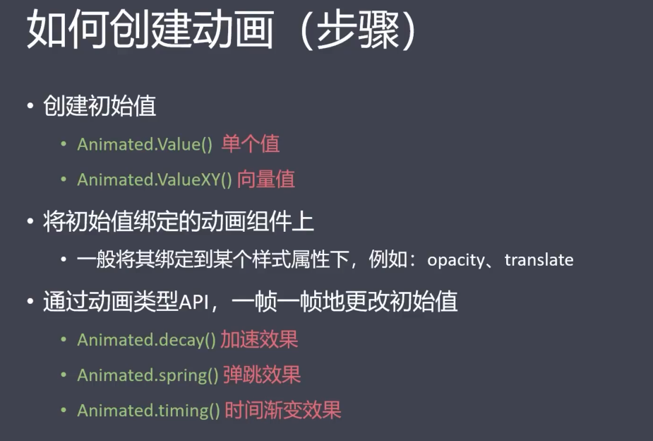

# React-Native移动开发实战笔记

# 创建项目

```
react-native init [name]
```

```
cd [name]
```

```
yarn android
```


# 快捷命令

### rnc(快速生成类组件)

```react
import React, { Component } from 'react'
import { Text, View } from 'react-native'

export default class App extends Component {
  render() {
    return (
      <View>
        <Text> textInComponent </Text>
      </View>
    )
  }
}
```


### 


# 调试项目

启动react-native点击ctrl+M->debug会自动跳转到浏览器


ctrl+O可以选择要调试的文件，添加断点再次运行程序可以执行调试


# React[native]语法

## JSX

jsx可以创建虚拟的DOM

```react

import React, { Component } from 'react'
import { Text, View } from 'react-native'

export default class App extends Component {
  render() {
    return (
      <View>
        <Text> textInComponent </Text>
      </View>
    )
  }
}

```

reader()方法用于页面的渲染操作


## async await

[(4条消息) async/await 的理解和用法_前端之神的博客-CSDN博客_async await](https://blog.csdn.net/qq_42941302/article/details/109245356?ops_request_misc=%7B%22request%5Fid%22%3A%22166497644416782248540925%22%2C%22scm%22%3A%2220140713.130102334..%22%7D&request_id=166497644416782248540925&biz_id=0&utm_medium=distribute.pc_search_result.none-task-blog-2~all~top_positive~default-1-109245356-null-null.142^v51^control,201^v3^control_2&utm_term=async和await用法&spm=1018.2226.3001.4187)


## StyleSheet

### rn中样式和css的不同

- 没有继承性（除了Text标签）

- 样式名称采用小驼峰命名
- 所有尺寸没有单位
- 有些特殊的样式名


### RN样式的声明方式

1. 通过style属性直接声明

   - 属性值为对象

     ```
     <组件 style={{样式}} />
     ```

   - 属性值为数组

     ```
     <组件 style={[{样式1},{样式2}]} />  //后面的样式会覆盖上面的样式
     ```

2. 在style属性中调用StyleSheet声明的样式

   - 引入：

     ```react
     import {StyleSheet,View} from 'react-native'
     ```

   - 声明：

     ```react
     const styles = StyleSheet.create({foo:{样式1},bar:{样式2}})
     ```

   - 使用

     ```react
     <View style = {[styles.foo,style.bar]}> 内容 </View>
     ```


```react
import React, { Component } from 'react'
import { Text, View ,StyleSheet} from 'react-native'

export default class index extends Component {
  render() {
    return (
      <View>
        <Text style = {{fontSize:30}}> textInComponent </Text>
        <Text style = {[{color:'red'}]}> textInComponent </Text>

        <Text style = {[styles.h1]}>xxx</Text>
      </View>
    )
  }
}

const styles = StyleSheet.create({
  h1:{
    fontSize:40,
    fontWeight:'bold'
  }
})

```


### Flexbox

#### Flexbox术语

- 容器（container）：采用flex布局的元素
- 项目（item）：容器内所有子元素
- 主轴：垂直方向（和cssweb相反）
- 交叉轴：水平方向


#### Flexbox属性

- flexDirection ：[row/column]
- justifyContent ：主轴对齐方式
- alignItems:交叉轴对齐方式
- flex：项目在主轴上的比例


```react
import { Text, StyleSheet, View } from 'react-native'
import React, { Component } from 'react'

export default class FlexDirection extends Component {
  render() {
    return (
      <View>
        <Text style={styles.h2}>主轴方向</Text>
        <View>
          <Text style={styles.h3}>flexDirection:'column'(默认)</Text>
        </View>
        <View style={styles.container}>
          <Text style = {styles.itemBase} >张景宣</Text>
          <Text style = {styles.itemBase}>周帅</Text>
          <Text style = {styles.itemBase}>建国</Text>
        </View>

        <View>
          <Text style={styles.h3}>flexDirection:'column-reverse'(默认)</Text>
        </View>
        <View style={styles.container}>
          <Text style = {[styles.itemBase,{flex:1}]} >张景宣</Text>
          <Text style = {[styles.itemBase,{flex:2}]}>周帅</Text>
          <Text style = {[styles.itemBase,{flex:3}]}>建国</Text>
        </View>
      </View>
    )
  }
}

const styles = StyleSheet.create({
  container:{
    height:150,
    margin:10,
    borderWidth:1,
    borderColor:'red',
    alignItem:'center',
    justifyContent: 'space-between',
    // flex:1
  },
  h2:{
    fontSize:30,
    marginHorizontal:10,
    },
  h3:{
    fontSize:24,
    marginHorizontal:10,
  },
  itemBase:{
    height:30,
    borderWidth:1,
    borderColor:'red',
    backgroundColor:'pink',
    padding:4,
    textAlign: 'center',
  }
})
```


### ImageBackground

Image组件必须在样式中声明图片的款和高。如果没有声明，则图片将不会被呈现在界面上。

我们一般将Image定义的宽和高乘以当前运行环境的像素密度称为Image的实际宽高.

当Image的实际宽、高与图片的实际宽、高不符时,视图片样式定义中resizeMode的取值不同而分为三种情况, 三个取值分别是: contain, cover和stretch.默认值是cover.

cover模式只求在显示比例不失真的情况下填充整个显示区域。可以对图片进行放大或者缩小，超出显示区域的部分不显示， 也就是说，图片可能部分会显示不了。
contain模式是要求显示整张图片, 可以对它进行等比缩小, 图片会显示完整,可能会露出Image控件的底色。 如果图片宽高都小于控件宽高，则不会对图片进行放大。
stretch模式不考虑保持图片原来的宽,高比.填充整个Image定义的显示区域,这种模式显示的图片可能会畸形和失真。
center模式, 9月11号的0.33版本才支持，contain模式基础上支持等比放大。居中不拉伸只等比缩小。


### positon

和html不同，right等定位词是基准 

[(2条消息) React Native中的 position 定位 及示例relative/absolute_Mars-xq的博客-CSDN博客_reactnative 相对定位](https://blog.csdn.net/sinat_31057219/article/details/108029821)


### textTransform

转大小写

[React Native textTransform uppercase lowercase capitalize Example (reactnative-examples.com)](https://reactnative-examples.com/react-native-texttransform/)


## 类组件的理解

在src_01建立index.js文件

```react
import React, { Component } from 'react'
import { Text, View } from 'react-native'

export default class index extends Component {  //这里建立的是一个类组件
  render() {
    return (
      <View>
        <Text> textInComponent </Text>
      </View>
    )
  }
}

```


在app.js引入index.js

```react
import { Text, View } from 'react-native'
import React, { Component } from 'react'
import Index from './src_01_StyleSheet/index';

export default class App extends Component {
  render() {
    return (
      <Index/>  //由于是一个类组件 所以可以直接这么引入 像一个标签一样 
    )
  }
}
```

**要外部调用或者显示的组件需要放到export default里**


# ------2022.10.5


### 


### 响应式布局 Dimensions

- Flexbox

- Dimensions获取屏幕尺寸

  ```react
  import {Dimensions} from 'react-native'
  ```

  ```react
  const windowWidth = Dimensions.get('window').width;
  ```

  ```react
  const windowHeight = Dimensions.get('window').height;
  ```

  

```react
itemBase:{
    justifyContent: 'center',
    alignItem:'center',
    backgroundColor:'pink',
    width:Dimensions.get('window').width/4,
    height:90,
    borderWidth:1,
    borderColor:'yellow',
  },
```


# 常用组件和api

从react-native import的组件时核心组件，他是封装了原生组件的

- View:视图组件
- Text:文本组件
- Alert:警告框
- Button:按钮组件
- Switch：开关组件
- StatusBar:状态栏组件
- ActivityIndicator:加载指示器组件
- Image:图片组件
- TextInput：输入框组件
- Touchable:触碰组件（共三个）
- ScrollView:滚动视图组件
- SectionList:分组列表组件
- FlatList:高性能列表组件
- Animated:动画组件


**组件的属性都用对象形式{}**


## button

自带属性 title onPress（触发事件，对象函数,callback） color，**button不能写style**

```react
<Button 
        style={styles.button}
        title="Alert.alert" 
        onPress = {()=>{
          Alert.alert('我是一个按钮')
        }} 
        color = {'red'}
        />
```


## Alert

按钮点击之后调用函数

```react
<Button 
        style={styles.button}
        title="两个按钮" 
        onPress = {this.createTwoButttonAlert} 
        color = {'pink'}
        />
```


```react
Alert.alert(
	"标题",
	"内容",
	[{按钮1},{按钮2},{按钮3}]  //如果有三个按钮那第一个按钮实在左侧
)
```


```react
createTwoButttonAlert = ()=>{  //这不加const
    Alert.alert(
      "警告标题",  
      "警告内容",
      [
        {
          text:"取消",
          onPress:()=>{console.log("cancel")},
          style:'cancel'
        },
        {
          text:"确认",
          onPress:()=>{console.log("Ok")},
          style:'default'
        },
      ]
    )
  }
```


## Switch&&StatusBar（状态栏）

```react
<StatusBar
          hidden = {false}
          backgroundColor ={'red'}
          barStyle={'dark-content'}
        />
```


```react
export default class index extends Component {
  constructor(){
    super()
    this.state = {
      hideStatusBar:false
    }
  }
  toggleStatusBar = ()=>{
    this.setState({
      hideStatusBar: !this.state.hideStatusBar
    })
  }
  render() {
    return (
      <View style = {[styles.container]}>
        <StatusBar
          hidden = {this.state.hideStatusBar}
          backgroundColor ={'red'}
          barStyle={'dark-content'}
        />
          <Text style = {[styles.itemBase]}>111</Text>
          <Switch 
            trackColor = {{false:'red',true:'green'}}
            thumbColor = {this.state.hideStatusBar?"red":"green"}
            value = {this.state.hideStatusBar}
            onValueChange={this.toggleStatusBar}
          />  
      </View>
    )
  }
}
```


## FlatList （滚动组件）

```js
<FlatList 
        data = {cars}
        renderItem={({item})=><CarItem car = {item}/>}  //渲染组件
        showsVerticalScrollIndicator = {false}//用来设置scrollView是否显示垂直滚动条.
        snapToAlignments={'start'} //设置向下翻页  'horizontal' 左右滚动
        decelerationRate={'fast'}  //翻页速度
        snapToInterval = {Dimensions.get('window').height}  //每次滚动一个屏幕
      />
```

[RN FlatList组件使用 - 简书 (jianshu.com)](https://www.jianshu.com/p/67e031f90d17)

```react
import React from 'react';
import { SafeAreaView, View, FlatList, StyleSheet, Text, StatusBar } from 'react-native';

const DATA = [
  {
    id: 'bd7acbea-c1b1-46c2-aed5-3ad53abb28ba',
    title: 'First Item',
  },
  {
    id: '3ac68afc-c605-48d3-a4f8-fbd91aa97f63',
    title: 'Second Item',
  },
  {
    id: '58694a0f-3da1-471f-bd96-145571e29d72',
    title: 'Third Item',
  },
];

const Item = ({ title }) => {
  return (
    <View style={styles.item}>
      <Text style={styles.title}>{title}</Text>
    </View>
  );
}

const App = () => {
  const renderItem = ({ item }) => (
    <Item title={item.title} />
  );

  return (
    <SafeAreaView style={styles.container}>
      <FlatList
        data={DATA}
        renderItem={renderItem}
        // horizontal = {true}
        initialNumToRender = {2}  //先加载前两条 懒惰加载 指定第一屏默认加载
        keyExtractor={item => item.id}
        numColumns = {1}  //指定列数 数据项必须等高 不支持瀑布流
        inverted = {false}  //列表反转
        extraData = {1}
      />
    </SafeAreaView>
  );
}

const styles = StyleSheet.create({
  container: {
    flex: 1,
    marginTop: StatusBar.currentHeight || 0,
  },
  item: {
    backgroundColor: '#f9c2ff',
    padding: 20,
    marginVertical: 8,
    marginHorizontal: 16,
  },
  title: {
    fontSize: 32,
  },
});

export default App;
```


## Dimensions

[RN FlatList组件使用 - 简书 (jianshu.com)](https://www.jianshu.com/p/67e031f90d17)’


## Touchable 组件

### TouchableHighlight

触碰后高亮显示

### TouchableOpacity

触碰后，透明度降低（模糊显示）

### TouchableWithoutFeedback

触碰后，无任何相应


```react
import { View, Text ,StyleSheet,TouchableHighlight,TouchableOpacity,TouchableWithoutFeedback} from 'react-native'
import React from 'react'

const TouchableDemo = () => {
  return (
    <View style={styles.container}> 
    <TouchableHighlight
      onPress = {()=>{console.log("高亮")}}
    >
      <View style={styles.item}>
        <Text>触碰高亮</Text>
      </View>
    </TouchableHighlight>

    <TouchableOpacity
      onPress = {()=>{console.log("透明度变化")}}
    >
      <View style={styles.item}>
        <Text>触碰高亮</Text>
      </View>
    </TouchableOpacity>

    <TouchableWithoutFeedback
      onPress = {()=>{console.log("触碰无响应")}}
    >
      <View style={styles.item}>
        <Text>触碰高亮</Text>
      </View>
    </TouchableWithoutFeedback>
    </View>
  )
}

export default TouchableDemo

const styles = StyleSheet.create({
  container: {
    flex: 1,
    justifyContent:'center',
    alignItems: 'center',
  },
  item:{
    padding:10,
    marginBottom:10,
    borderColor: 'red',
    borderWidth:1
  }
})
```


## ScrollView滚动视图

view标签无法显示超出的内容，所以这时候需要ScrollView

- contentContainerStyle  //内容样式
- showsVerticalScrollIndicator  //显示滚动条
- horizontal //水平排列 水平滚动

```react
import { View, Text,StyleSheet ,ScrollView } from 'react-native'
import React from 'react'

const ScrollViewDemo = () => {
  return (
	<View>
         <ScrollView
        style = {{backgroundColor:'green'}}
        horizontal = {true}  //设置水平滚动，并且元素水平排列
      >
        <Text style={styles.nav}>娱乐</Text>
        <Text style={styles.nav}>新闻</Text>
        <Text style={styles.nav}>体育</Text>
        <Text style={styles.nav}>财经</Text>
        <Text style={styles.nav}>军事</Text>
        <Text style={styles.nav}>时尚</Text>
        <Text style={styles.nav}>科技</Text>
      </ScrollView>
    <ScrollView
      style={styles.scrollView} 
      contentContainerStyle={{margin:30}}  //面向scroll中的内容
        showsVerticalScrollIndicator = {false}//取消滚动条
    >
      <Text style={styles.text}>
          Task :app:installDebug
    Installing APK 'app-debug.apk' on 'android_phone(AVD) - 12' for :app:debug
    Installed on 1 device.

    Deprecated Gradle features were used in this build, making it incompatible with Gradle 8.0.
    You can use '--warning-mode all' to show the individual deprecation warnings and determine if they come from your own scripts or plugins.
      </Text>
    </ScrollView>
	</View>

  )
}

export default ScrollViewDemo

const styles = StyleSheet.create({
  scrollView:{
    backgroundColor:'pink',
    marginHorizontal:20  //水平方向外边距
  },
  text:{
    fontSize:50
  }
})
```


### Android bug


无法滚动到底

在ScrollView最下面设置一个view给一个尺寸

```
<View style = {{height:Platform.OS==='ios'?0:200}}></View>
```


### SafeAreaView

开发建议使用SafeAreaView


## SectionList

带有分组效果的列表


```react
import React from "react";
import { StyleSheet, Text, View, SafeAreaView, SectionList, StatusBar } from "react-native";

const DATA = [
  {
    title: "Main dishes",
    data: ["Pizza", "Burger", "Risotto"]
  },
  {
    title: "Sides",
    data: ["French Fries", "Onion Rings", "Fried Shrimps"]
  },
  {
    title: "Drinks",
    data: ["Water", "Coke", "Beer"]
  },
  {
    title: "Desserts",
    data: ["Cheese Cake", "Ice Cream"]
  }
];

const Item = ({ title }) => (
  <View style={styles.item}>
    <Text style={styles.title}>{title}</Text>
  </View>
);

const App = () => (
  <SafeAreaView style={styles.container}>
    <SectionList
      sections={DATA}//要渲染的数据 是一个数组
      keyExtractor={(item, index) => item + index}
      renderItem={({ item }) => <Item title={item} />}  //结构传递参数
      renderSectionHeader={({ section: { title} }) => (
        <Text style={styles.header}>{title}1</Text>
      )}
      ItemSeparatorComponent = {()=>{ //项目之间的分隔符
        return <View style = {{borderBottomWidth:1,borderBottomColor:'red'}}></View>
      }}
      ListEmptyComponent = {()=>{ //数据为空显示的组件
        return <Text style = {{fontSize:30}}>空空如也</Text>
      }}
      //下拉刷新
      refreshing = {false} //指示器是否出现
      onRefresh = {()=>{
        alert("下拉刷新")
      }}

      //上拉刷新
      onEndReachedThreshold = {0.1} //距离底部还有百分之十
      onEndReached = {()=>{
        alert("到底了")
      }}
      //列表的头组件
      ListHeaderComponent = {()=>{
        return <Text>头部</Text>
      }}
      ListFooterComponent = {()=>{
        return <Text>尾部</Text>
      }}
    />
  </SafeAreaView>
);

const styles = StyleSheet.create({
  container: {
    flex: 1,
    paddingTop: StatusBar.currentHeight,
    marginHorizontal: 16
  },
  item: {
    backgroundColor: "#f9c2ff",
    padding: 20,
    marginVertical: 8
  },
  header: {
    fontSize: 32,
    backgroundColor: "#fff"
  },
  title: {
    fontSize: 24
  }
});

export default App;
```


## Animated



创建动画最基本的工作流程是先创建一个 `Animated.Value` ，将它连接到动画组件的一个或多个样式属性，然后使用`Animated.timing()`通过动画效果展示数据的变化：

```js
import React, { useRef ,useEffect} from "react";
import { Animated, Text, View, StyleSheet, Button } from "react-native";

const App = () => {
  // fadeAnim will be used as the value for opacity. Initial Value: 0
  const fadeAnim = useRef(new Animated.Value(0)).current;//设置初始值为0
  const moveAnim = useRef(new Animated.Value(0)).current;

  
  // scanMove()

  const fadeIn = () => {
    // Will change fadeAnim value to 1 in 5 seconds
    Animated.timing(fadeAnim, {
      toValue: 1,
      duration: 5000,
      useNatibeDriver:true //启动原生方式渲染动画 执行效率更高
    }).start(()=>{
      //动画执行之后的回调函数
      alert("我显示出来了")
    });
  };

  const fadeOut = () => {
    // Will change fadeAnim value to 0 in 5 seconds
    Animated.timing(fadeAnim, {
      toValue: 0,
      duration: 5000,
      useNatibeDriver:true //启动原生方式渲染动画 执行效率更高
    }).start(()=>{
      alert("我隐藏起来了")
    });
  };
  
  const scanMove = ()=>{
    moveAnim.setValue(0);
    console.log(moveAnim)
    Animated.timing(moveAnim,{
      toValue: 200,
      duration: 2000,
      useNativeDriver:true
    }).start(()=>{
      scanMove();
    })
  }
  

  // useEffect = (()=>{
  //   // scanMove()
  //   console.log("Scanning")
  // },[fadeAnim,moveAnim])

  return (
    <View style={styles.container}>
      <Animated.View
        style={[
          styles.fadingContainer,
          {
            opacity: fadeAnim // Bind opacity to animated value
          }
        ]}
      >
        <Text style={styles.fadingText}>Fading View!</Text>
      </Animated.View>
      <View style={styles.buttonRow}>
        <Button title="Fade In" onPress={fadeIn} />
        <Button title="Fade Out" onPress={fadeOut} />
      </View>

      <View style={styles.scanContainer}>
        <Animated.View
          style={[styles.border,{
            transform: [{
              translateY:moveAnim
          }]
        }]
        }
        />

    <Button title="Scan" onPress={scanMove} />
      </View>
    </View>
  );
}

const styles = StyleSheet.create({
  container: {
    flex: 1,
    alignItems: "center",
    justifyContent: "center"
  },
  fadingContainer: {
    paddingVertical: 8,
    paddingHorizontal: 16,
    backgroundColor: "powderblue"
  },
  fadingText: {
    fontSize: 28,
    textAlign: "center",
    margin: 10
  },
  buttonRow: {
    flexDirection: "row",
    marginVertical: 16
  },
  scanContainer:{
    height:200,
    width:200,
    borderWidth:1,
    borderColor: "pink"
  },
  border:{
    borderWidth:1,
    borderColor: "red"
  }
});

export default App;
```


# 第三方组件


## WebView

[react-native-webview/react-native-webview: React Native Cross-Platform WebView (github.com)](https://github.com/react-native-webview/react-native-webview)

### 安装

```
yarn add react-native-webview
```

### 使用

- 直接指定url地址
- 直接渲染html代码

```js
import { View, Text } from 'react-native'
import React from 'react'
import {WebView} from 'react-native-webview'

const WebViewDemo = () => {
  return (
    <View>
      <WebView  
        source = {{uri : 'http://m.baidu.com/'}}
        style = {{marginTop:20}}
      />
    </View>
  )
}

export default WebViewDemo
```

```js
import { View, Text } from 'react-native'
import React from 'react'
import {WebView} from 'react-native-webview'

const WebViewDemo = () => {
  return (
    <View>
      <WebView  
        source = {{html:'<h1>Hello world </h1>'}}
        style = {{marginTop:20}}
      />
    </View>
  )
}

export default WebViewDemo
```


## Picker 下拉框

```
import {Picker} from '@react-native-picker/picker';
const [selectedLanguage, setSelectedLanguage] = useState();
<Picker
  selectedValue={selectedLanguage}
  onValueChange={(itemValue, itemIndex) =>
    setSelectedLanguage(itemValue)
  }>
  <Picker.Item label="Java" value="java" />
  <Picker.Item label="JavaScript" value="js" />
</Picker>
```


## Swiper 轮播

[leecade/react-native-swiper: The best Swiper component for React Native. (github.com)](https://github.com/leecade/react-native-swiper)


```js
import React, { Component } from 'react'
import { AppRegistry, StyleSheet, Text, View } from 'react-native'

import Swiper from 'react-native-swiper'

const styles = StyleSheet.create({
  wrapper: {},
  slide1: {
    flex: 1,
    justifyContent: 'center',
    alignItems: 'center',
    backgroundColor: '#9DD6EB'
  },
  slide2: {
    flex: 1,
    justifyContent: 'center',
    alignItems: 'center',
    backgroundColor: '#97CAE5'
  },
  slide3: {
    flex: 1,
    justifyContent: 'center',
    alignItems: 'center',
    backgroundColor: '#92BBD9'
  },
  text: {
    color: '#fff',
    fontSize: 30,
    fontWeight: 'bold'
  }
})

function SwiperDemo() {
  return (
    <Swiper style={styles.wrapper} 
		showsButtons={true}
		autoplay = {true}
	>
      <View style={styles.slide1}>
        <Text style={styles.text}>Hello Swiper</Text>
      </View>
      <View style={styles.slide2}>
        <Text style={styles.text}>Beautiful</Text>
      </View>
      <View style={styles.slide3}>
        <Text style={styles.text}>And simple</Text>
      </View>
    </Swiper>
  )
}


export default SwiperDemo
```


## AsyncStorage  持久化存储数据

[Installation | Async Storage (react-native-async-storage.github.io)](https://react-native-async-storage.github.io/async-storage/docs/install/)

安装

```js
yarn add @react-native-async-storage/async-storage
```


```js
import { View, Text,Button ,StyleSheet} from 'react-native'
import React from 'react'
import AsyncStorage from '@react-native-async-storage/async-storage';

const AsyncStorageDemo = () => {

  const storeData = async (value) => {
    try {
      await AsyncStorage.setItem('mytest', value)
    } catch (e) {
      // saving error
    }
  }


  
const getData = async () => {
  try {
    const value = await AsyncStorage.getItem('mytest')
    if(value !== null) {
      // value previously stored
      alert(value);
    }
  } catch(e) {
    // error reading value
  }
}


  return (
    <View style={styles.container}>
      <Button 
        title = "存档"
        onPress = {()=>{storeData("hello rn")}}
      />
      <Button 
        title = "读档"
        onPress = {()=>{getData()}}
      />
    </View>
  )
}

const styles = StyleSheet.create({
  container: {
    flex:1,
    justifyContent: 'center',
    alignItems: 'center'
  }
})

export default AsyncStorageDemo
```


### 封装AsyncStorage

- 增

  

- 删

- 改

- 查


# React组件详解

组件分为有状态组件和无状态组件

无状态组件时只做纯静态展示的组件，由props属性和render渲染函数构成

通过React.Component创建的组件都是有状态组件，带有生命周期

## 有状态组件：

```react
import { Text, StyleSheet, View } from 'react-native'
import React, { Component } from 'react'

export default class TetView extends Component {
  constructor(props) {
    super(props); //传递props给component
    this.state = {

    }
  }
  render() {
    return (
      <View>
        <Text>我是一个Text</Text>
      </View>
    )
  }
}

const styles = StyleSheet.create({})
```


## 无状态组件：

```react
const todo = (props) => {
  return (
    <li
      onClick={props.onClick}
      style = {{textDecoration : props.complete ? '"line-through':"none"}}
    ></li>
  )
}

```


## props&&state

Q：构造器为什么非要写super(props)

A:这是初始化this，必须写

详细：[React构造函数中为什么要写 super(props)_huangpb0624的博客-CSDN博客](https://blog.csdn.net/huangpb123/article/details/85009024)****


结构的技巧

```js
const {type,content,onPress} = props;
```


# react navigation

安装

```
npm install --save react-navigation
```


## Stack Navigator

堆栈式的路由

### 增加导航库组件

```
npm install @react-navigation/native-stack
```


### Stack Navigator导航示例

