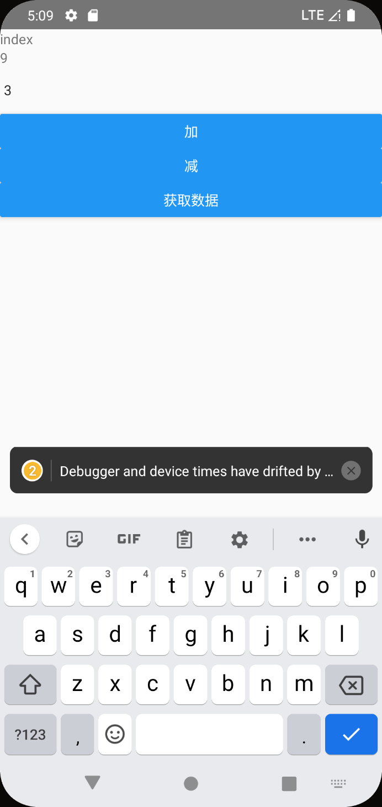
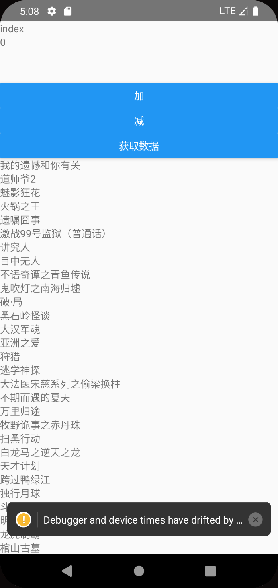

[react-redux 文档 · Redux](https://www.redux.org.cn/docs/react-redux/)


whats redux

whats redux-toolkit

## 安装

```js
npm install @reduxjs/toolkit react-redux
```


## 创建store

store下面添加两个文件

- index.js  仓库的入口文件
- reducer.js 创建初始状态，并导出一个函数


# redux基础概念

## Redux 是什么？

首先理解 “Redux” 是什么。它有什么作用？它帮助我解决什么问题？我为什么要使用它？

**Redux 是一个使用叫做 “action” 的事件来管理和更新应用状态的模式和工具库** 它以集中式 Store（centralized store）的方式对整个应用中使用的状态进行集中管理，其规则确保状态只能以可预测的方式更新。

### 为什么要使用 Redux？

Redux 帮你管理“全局”状态 - 应用程序中的很多组件都需要的状态。

**Redux 提供的模式和工具使你更容易理解应用程序中的状态何时、何地、为什么、state 如何被更新，以及当这些更改发生时你的应用程序逻辑将如何表现**. Redux 指导你编写可预测和可测试的代码，这有助于你确信你的应用程序将按预期工作。

### 我什么时候应该使用 Redux？

Redux 可帮助你处理共享状态的管理，但与任何工具一样，它也需要权衡利弊。使用 Redux 有更多的概念需要学习，还有更多的代码需要编写，需要添加了一些额外代码，并要求你遵循某些限制。这是短期和长期生产力之间的权衡。

在以下情况下使用 Redux：

- 应用中有很多 state 在多个组件中需要使用
- 应用 state 会随着时间的推移而频繁更新
- 更新 state 的逻辑很复杂
- 中型和大型代码量的应用，很多人协同开发


**[Redux Toolkit](https://redux-toolkit.js.org/)** 是 Redux 官方强烈推荐，开箱即用的一个高效的 Redux 开发工具集。它旨在成为标准的 Redux 逻辑开发模式，我们强烈建议你使用它。


## 术语

### Action

 **action** 是一个具有 `type` 字段的普通 JavaScript 对象。**你可以将 action 视为描述应用程序中发生了什么的事件**.

```js
const addTodoAction = {
  type: 'todos/todoAdded',
  payload: 'Buy milk'
}
```


#### Action Creator

**action creator** 是一个创建并返回一个 action 对象的函数。它的作用是让你不必每次都手动编写 action 对象：

```js
const addTodo = text => {
  return {
    type: 'todos/todoAdded',
    payload: text
  }
}//这个addTodo就是一个action creator
```


### Reducer

**reducer** 是一个函数，接收当前的 `state` 和一个 `action` 对象，必要时决定如何更新状态，并返回新状态。函数签名是：`(state, action) => newState`。 **你可以将 reducer 视为一个事件监听器，它根据接收到的 action（事件）类型处理事件。**


reducer 函数内部的逻辑通常遵循以下步骤：

- 检查 reducer 是否关心这个 action
  - 如果是，则复制 state，使用新值更新 state 副本，然后返回新 state
- 否则，返回原来的 state 不变

```js
const initialState = { value: 0 }

function counterReducer(state = initialState, action) {
  // 检查 reducer 是否关心这个 action
  if (action.type === 'counter/increment') {
    // 如果是，复制 `state`
    return {
      ...state,
      // 使用新值更新 state 副本
      value: state.value + 1
    }
  }
  // 返回原来的 state 不变
  return state
}
```


### Store

当前 Redux 应用的 state 存在于一个名为 **store** 的对象中。

store 是通过传入一个 reducer 来创建的，并且有一个名为 `getState` 的方法，它返回当前状态值：

```js
import { configureStore } from '@reduxjs/toolkit'

const store = configureStore({ reducer: counterReducer })

console.log(store.getState())
// {value: 0}
```


### Dispatch

Redux store 有一个方法叫 `dispatch`。**更新 state 的唯一方法是调用 `store.dispatch()` 并传入一个 action 对象**。 store 将执行所有 reducer 函数并计算出更新后的 state，调用 `getState()` 可以获取新 state。

```js
store.dispatch({ type: 'counter/increment' })

console.log(store.getState())
// {value: 1}
```


**dispatch 一个 action 可以形象的理解为 "触发一个事件"**。发生了一些事情，我们希望 store 知道这件事。 Reducer 就像事件监听器一样，当它们收到关注的 action 后，它就会更新 state 作为响应。

dispath：传入action对象->作为参数传入初始化的reducer->进行判断更新


我们通常调用 action creator 来调用 action：

```js
const increment = () => {
  return {
    type: 'counter/increment'
  }
}

store.dispatch(increment() //这里返回action对象)

console.log(store.getState())
// {value: 2}
```


### Selector

**Selector** 函数可以从 store 状态树中提取指定的片段。随着应用变得越来越大，会遇到应用程序的不同部分需要读取相同的数据，selector 可以避免重复这样的读取逻辑：

```js
const selectCounterValue = state => state.value

const currentValue = selectCounterValue(store.getState())
console.log(currentValue)
// 2
```

简单来说就是写一个函数返回状态量的一个元素


# React+Redux应用的解构

## 计数器示例应用程序

也就是说store是管理状态的，初始化需要用configureStore，传入参数是一个reducer，reducer是一个处理函数，接受的是state和action，根据action来改变state

以下是构成此应用程序的关键文件：

- /src
  - `index.js`: app 入口
  - `App.js`: 顶级 React 组件
  - /app
    - `store.js`: 创建 Redux store 实例
  - /features
    - /counter
      - `Counter.js`: 展示 counter 特性的 React 组件
      - `counterSlice.js`: counter 特性相关的 redux 逻辑

### 创建Redux Store

app/store.js

```js
import { configureStore } from '@reduxjs/toolkit'
import counterReducer from '../features/counter/counterSlice'

export default configureStore({
    counter:counterReducer  //固定写法 value是自己写好的reducer函数,key是代表有一个state.counter
})
```


#### redux Slice的概念

**“slice” 是应用中单个功能的 Redux reducer 逻辑和 action 的集合**, 通常一起定义在一个文件中。该名称来自于将根 Redux 状态对象拆分为多个状态 “slice”。

比如，在一个博客应用中，store 的配置大致长这样：

```js
import { configureStore } from '@reduxjs/toolkit'
import usersReducer from '../features/users/usersSlice'
import postsReducer from '../features/posts/postsSlice'
import commentsReducer from '../features/comments/commentsSlice'

export default configureStore({
  reducer: {
    users: usersReducer,
    posts: postsReducer,
    comments: commentsReducer
  }
})
```

例子中，`state.users`，`state.posts`，和 `state.comments` 均是 Redux state 的一个 独立的 “slice”。由于 `usersReducer` 负责更新 `state.users` slice，我们将其称为 “slice reducer” 函数。

*slice代表一个状态值的一个元素所对应的一系列属性，其中包括reducer（更新该状态的函数），所以修改state.user的reducer函数，也就是userReducer被称为slice reducer函数*


### 创建Slice Reducer 和Action

features/counter/counterSlice.js

```js
import { createSlice } from '@reduxjs/toolkit'

export const counterSlice = createSlice({  //创建state.counter的slice
    name:'counter', //action的第一部分
    initialState:{
        value:0  //reducer中都是写value，对应state.counter,在reducer中调用值也是直接写state.value
    },//初始值
    reducers:{
        increment:state =>{ //action的第二部分
               // Redux Toolkit 允许我们在 reducers 写 "可变" 逻辑。
              // 并不是真正的改变 state 因为它使用了 immer 库
              // 当 immer 检测到 "draft state" 改变时，会基于这些改变去创建一个新的
              // 不可变的 state
            state.value+=1
        },
        decrement:state=>{
            state.value-=1
        },
        incrementByAmount:(state,action)=>{
            state.value+=action.payload
        }
    }
})

export const {increment,decrement,incrementByAmount} = counterSlice.actions //返回action对象，进行解构

export default couterSlice.reducer //这里是通过对createSlice创建的slice对象中的reducer的固定调用，所以你会看到counterSlice中是reducers，但是这里是reducer
```

Redux Toolkit 有一个名为 `createSlice` 的函数，它负责生成 action 类型字符串、action creator 函数和 action 对象的工作。你所要做的就是为这个 slice 定义一个名称，编写一个包含 reducer 函数的对象，它会自动生成相应的 action 代码。


`name` 选项的字符串用作每个 action 类型的第一部分，每个 reducer 函数的键名用作第二部分。因此，`"counter"` 名称 + `"increment"` reducer 函数生成了一个 action 类型 `{type: "counter/increment"}`。


这里理解一下， reducer函数需要传入action来进行函数调用，同时也可以通过

```js
counterSlice.actions.increment() 来获取reducer函数中需要的action对象
```


### 用Thunk编写异步逻辑

我们需要一个地方在我们的 Redux 应用程序中放置异步逻辑。

**thunk** 是一种特定类型的 Redux 函数，可以包含异步逻辑。Thunk 是使用两个函数编写的：

- 一个内部 thunk 函数，它以 `dispatch` 和 `getState` 作为参数
- 外部创建者函数，它创建并返回 thunk 函数


也是reducer函数，但是不写咋icreateSlice中

```js
export const incrementAsync = createAsyncThunk(
  'counter/fetchCount',  //actions
  async (amount) => {
    const response = await fetchCount(amount);
    // The value we return becomes the `fulfilled` action payload
    return response.data;
  }
);
```


### React Count 组件

features/counter/Counter.js

```js
import React, { useState } from 'react'
import { useSelector, useDispatch } from 'react-redux'
import {
  decrement,
  increment,
  incrementByAmount,
  incrementAsync,
  selectCount
} from './counterSlice'
import styles from './Counter.module.css'

export function Counter() {
  const count = useSelector(selectCount)
  const dispatch = useDispatch()
  const [incrementAmount, setIncrementAmount] = useState('2')

  return (
    <div>
      <div className={styles.row}>
        <button
          className={styles.button}
          aria-label="Increment value"
          onClick={() => dispatch(increment())}
        >
          +
        </button>
        <span className={styles.value}>{count}</span>
        <button
          className={styles.button}
          aria-label="Decrement value"
          onClick={() => dispatch(decrement())}
        >
          -
        </button>
      </div>
      {/* 这里省略了额外的 render 代码 */}
    </div>
  )
}
```


这里的state可以理解为全局变量，因为创建了store，所以就会有了全局state

```js
// selector 函数允许我们从 state 中获取值
// Selectors 也可以在使用的地方内联的方式定义
// 而不是仅仅只能在 slice 文件中。例如 : `useSelector((state) => state.counter.value)`
export const selectCount = state => state.counter.value
```


相当于useState，useSelector传入的参数是初始值

```
const count = useSelector(selectCount)
```

每当一个 action 被 dispatch 并且 Redux store 被更新时，`useSelector` 将重新运行我们的选择器函数。如果选择器返回的值与上次不同，`useSelector` 将确保我们的组件使用新值重新渲染。


可以直接dispatch（）调用reducer方法，通过传入的action不同，选择修改state中哪个参数，调用哪个方法

```js
const dispatch = useDispatch()
```


increment是createSlice中reducers函数的一个函数对象

```js
export const { increment, decrement, incrementByAmount } = counterSlice.actions;
```


```js
<button
  className={styles.button}
  aria-label="Increment value"
  onClick={() => dispatch(increment())}
>
  +
</button>
```


### 组件与state表单

本地变量用useState，全局变量用store


### Providing the Store

我们已经看到我们的组件可以使用 `useSelector` 和 `useDispatch` 这两个 hooks 与 Redux 的 store 通信。奇怪的是，我们并没有导入 store，那么这些 hooks 怎么知道要与哪个 Redux store 对话呢？

现在我们已经看到了这个应用程序的全貌，是时候回到这个应用程序的起点，看看拼图的最后部分是如何组合在一起的。


```js
import React from 'react'
import ReactDOM from 'react-dom'
import './index.css'
import App from './App'
import store from './app/store' 
import { Provider } from 'react-redux' //引用provider和store文件
import * as serviceWorker from './serviceWorker'

ReactDOM.render(
  <Provider store={store}>
    <App />
  </Provider>,
  document.getElementById('root')
)
```

现在，任何调用 `useSelector` 或 `useDispatch` 的 React 组件都可以访问 `<Provider>` 中的 store。


# 数据流基础

## 主页的文章列表


# 12.29自学稀土掘金

 [Redux 最佳实践 Redux Toolkit 🔥🔥 - 掘金 (juejin.cn)](https://juejin.cn/post/7101688098781659172#comment)


## store的文件结构

- 创建一个store文件夹
- 创建一个index.ts做为主入口
- 创建一个festures文件夹用来装所有的store
- 创建一个counterSlice.ts文件，并导出简单的加减方法

最外层创建redux_component文件下，存放index.js用于写页面的UI


## 简单的加减1

store/index.js

```js
import {configureStore} from 'redux/toolkit'

import counterSlice from './features/counterSlice'

const store = configureStore({
  reducer:{
    counter:counterSlice
  }
})

export default store;
```


store/features/counterSlice.js

```js
//导出简单的加减法运算
import {createSlice} from '@reduxjs/toolkit'


const initialState = {
  value:0,
  title:'redux toolkit pre'
}
//这里export是为了store文件中生成store
export  const counterSlice = createSlice({
  name:'counter',  //定义actions的头
  initialState,
  reducers:{ 
    //同时生成action：counter/increment
    increment:(state)=>{
      state.value+=1;
    },
    decrement:(state)=>{
      state.value-=1;
    }
  }
})


//这里调出的是actions对象 increment:'counter/increment'
export const {increment, decrement} = counterSlice.actions;

//调出reducers中加减的函数
export default counterSlice.reducer
```


app.js中全局调用

```js
import { StyleSheet, Text, View } from 'react-native'
import React from 'react'
import Index from './redux_component/Index'

//STORE 引用
import { Provider } from 'react-redux';
import store from './store/index'
const App = ()=> {
  return (
      <Provider store={store}>
        <Index/>
      </Provider>
     
  )
}

export default App;
```


界面UI（redux_component/index.js）

```js
import { StyleSheet, Text, View,Button } from 'react-native'
import React from 'react'

//引入相关hooks
import { useSelector,useDispatch } from 'react-redux'
//引入reducers中的相应方法
import { increment,decrement } from '../store/features/counterSlice'

const Index = ()=> {
  //通过useSelector直接拿到store中定义的value
  const {value} = useSelector((store)=>store.counter)
  //通过useDispatch 派发事件，传入action参数，不需要引入reducer
  const dispatch = useDispatch();
  return (
    <View>
      <Text>index</Text>
      <Text>{value}</Text>
      <Button title = "加" onPress={()=>{dispatch(increment())}}></Button>
      <Button title = "减" onPress={()=>{dispatch(decrement())}}></Button>
    </View>
  )
}

export default Index;
```


```js
import { StyleSheet, Text, View,Button,TextInput } from 'react-native'
import React,{useState} from 'react'

//引入相关hooks
import { useSelector,useDispatch } from 'react-redux'
//引入reducers中的相应方法
import { increment,decrement } from '../store/features/counterSlice'

const Index = ()=> {
  //通过useSelector直接拿到store中定义的value
  const {value} = useSelector((store)=>store.counter)
  //通过useDispatch 派发事件
  const dispatch = useDispatch();
  const [amount,setAmount] = useState(1);
  return (
    <View>
      <Text>index</Text>
      <Text>{value}</Text>
      //这里setAmount的+是为了将输入input的字符出转变为整形
      <TextInput value = {amount} onChangeText = {(text)=>setAmount(+text)}  />
      <Button title = "加" onPress={()=>{dispatch(increment({value:amount}))}}></Button>
      <Button title = "减" onPress={()=>{dispatch(decrement())}}></Button>
    </View>
  )
}

export default Index;
```


## 传递参数达到想加(减)多少

```js
import { StyleSheet, Text, View,Button,TextInput } from 'react-native'
import React,{useState} from 'react'

//引入相关hooks
import { useSelector,useDispatch } from 'react-redux'
//引入reducers中的相应方法
import { increment,decrement } from '../store/features/counterSlice'

const Index = ()=> {
  //通过useSelector直接拿到store中定义的value
  const {value} = useSelector((store)=>store.counter)
  //通过useDispatch 派发事件
  const dispatch = useDispatch();
  const [amount,setAmount] = useState(1);
  return (
    <View>
      <Text>index</Text>
      <Text>{value}</Text>
      //RN和react不同，rn使用text，react使用e/e.target.value
      <TextInput value = {amount} onChangeText = {(text)=>setAmount(+text)}  />
      <Button title = "加" onPress={()=>{dispatch(increment({value:amount}))}}></Button>
      <Button title = "减" onPress={()=>{dispatch(decrement())}}></Button>
    </View>
  )
}

export default Index;
```


```js
console.log(increment());
//{"payload": undefined, "type": "counter/increment"}
```

我们可以看出来 这个increment() 是一个函数，返回一个对象包含两个字段，其实也就是action

那么他可以接受参数，payload，所以就是一个actionCreator

所以上面传入参数{value:amount}其实就是传入一个payload

```js
//导出简单的加减法运算
import {createSlice} from '@reduxjs/toolkit'


const initialState = {
  value:0, 
  title:'redux toolkit pre'
}
//这里可以加export也可以不加
 const counterSlice = createSlice({
  name:'counter',  //定义actions的头
  initialState,  //state的初始值
  reducers:{ 
    //同时生成action：counter/increment
    //这里的payload就是action creator中返回的action中的payload
    increment:(state,{payload})=>{
      console.log(state);
      state.value+=payload.value //这里的value和上面value对应
    },
    decrement:(state)=>{
      state.value-=1;
    }
  }
})

console.log(counterSlice.reducer)

//这里调出的是actions对象 increment:'counter/increment'
export const {increment, decrement} = counterSlice.actions;

//调出reducers中加减的函数
export default counterSlice.reducer
```

接受传递的参数时，需要给reducers的函数第二个字段是action，包含type和payload，这里直接结构出payload，payload也是一个对象值为{value:"1"}




## 如何进行异步调用


`createAsyncThunk` 接收 2 个参数:

- 将用作生成的 action 类型的前缀的字符串
- 一个 “payload creator” 回调函数，它应该返回一个包含一些数据的 `Promise`，或者一个被拒绝的带有错误的 `Promise`

根据两个参数返回action

### extraReducers

但是，有时 slice 的 reducer 需要响应 *没有* 定义到该 slice 的 `reducers` 字段中的 action。这个时候就需要使用 slice 中的 `extraReducers` 字段。

`extraReducers` 选项是一个接收名为 `builder` 的参数的函数。`builder` 对象提供了一些方法，让我们可以定义额外的 case reducer，这些 reducer 将响应在 slice 之外定义的 action。我们将使用 `builder.addCase(actionCreator, reducer)` 来处理异步 thunk dispatch 的每个 action。


```js
import { createSlice, createAsyncThunk } from '@reduxjs/toolkit';


const initialState = {
  list: [],
  totals: 0
};

// 请求电影列表
const getMovieListApi = ()=> 
  fetch(
    'https://pcw-api.iqiyi.com/search/recommend/list?channel_id=1&data_type=1&mode=24&page_id=1&ret_num=48'
  ).then(res => res.json())

// thunk函数允许执行异步逻辑, 通常用于发出异步请求。
// createAsyncThunk 创建一个异步action，方法触发的时候会有三种状态：
// pending（进行中）、fulfilled（成功）、rejected（失败）
export const getMovieData = createAsyncThunk( 'movie/getMovie', 
  async () => {
    const res= await getMovieListApi();
    return res;
  }
);

// 创建一个 Slice 
export const movieSlice = createSlice({
  name: 'movie',
  initialState,
  reducers: {
    // 数据请求完触发
    loadDataEnd: (state, {payload}) => {
      state.list = payload;
      state.totals = payload.length;
    },
  },
  // extraReducers 字段让 slice 处理在别处定义的 actions， 
  // 包括由 createAsyncThunk 或其他slice生成的actions。
  extraReducers(builder) {
    builder
    .addCase(getMovieData.pending, (state) => {
      console.log("🚀 ~ 进行中！")
    })
    //这里的payload就是action creator中返回的action中的信息值
    .addCase(getMovieData.fulfilled, (state, {payload}) => {
      console.log("🚀 ~ fulfilled", payload);
      console.log(payload);
      state.list = payload.data.list
      state.totals = payload.data.list.length
    })
    .addCase(getMovieData.rejected, (state, err) => {
      console.log("🚀 ~ rejected", err)
    });
  },
});

// 导出方法
export const { loadDataEnd } = movieSlice.actions;

// 默认导出
export default movieSlice.reducer;


```


```js
import { StyleSheet, Text, View,Button,TextInput } from 'react-native'
import React,{useState} from 'react'

//引入相关hooks
import { useSelector,useDispatch } from 'react-redux'
//引入reducers中的相应方法
import { increment,decrement } from '../store/features/counterSlice'
import { getMovieData } from '../store/features/movieSlice'
const Index = ()=> {
  //通过useSelector直接拿到store中定义的value
  const {value} = useSelector((store)=>store.counter)
  const {list} = useSelector((store)=>store.movie)
  //通过useDispatch 派发事件
  const dispatch = useDispatch();
  const [amount,setAmount] = useState(1);
  return (
    <View>
      <Text>index</Text>
      <Text>{value}</Text>
      <TextInput value = {amount} onChangeText = {(text)=>setAmount(+text)}  />
      <Button title = "加" onPress={()=>{dispatch(increment({value:amount}))}}></Button>
      <Button title = "减" onPress={()=>{dispatch(decrement())}}></Button>
//getMovieData是一个通过createAsyncThunk创建的action
      <Button title = "获取数据" onPress={()=>{dispatch(getMovieData())}}></Button>
      <View>
        {
          list.map((item)=>{return <Text key = {item.tvId} >{item.name} </Text>})
        }
      </View>
    </View>
  )
}

export default Index;
```


